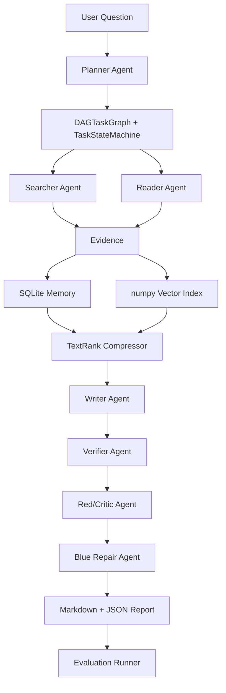

# DeepResearch Agent 项目设计文档

## 1. 项目定位

DeepResearch Agent 是一个面向复杂深度研究任务的多智能体协作系统。它不是普通 RAG demo，也不是只调用一次 LLM 生成答案，而是把研究任务拆成一条可观察、可追踪、可验证、可修复、可评测的工程流水线。

当前实现采用离线优先策略：mock LLM、本地 corpus、SQLite 记忆、numpy 向量索引和 ResearchBench-style 数据集都可以在无网络环境下复现。真实 LLM 后端作为可选增强，默认不影响测试和实验。

项目最终希望支撑的能力：

- Planner / Searcher / Reader / Writer / Critic / Verifier / Blue Repair 多 Agent 协作。
- asyncio + Semaphore + DAG 拓扑批次执行。
- SQLite 共享记忆和 numpy 向量相似召回。
- TextRank 上下文压缩与 citation quote 保护。
- atomic claim verification、引用追踪和幻觉检测。
- Red-Blue 对抗发现与 ADD / DELETE / MODIFY / VERIFY 修复动作。
- ResearchBench / adversarial suite 自动评测，输出 Bootstrap 95% CI 和 Cohen's d。
- Mock / OpenAI-compatible / DeepSeek / vLLM 后端适配骨架。

## 2. 当前架构



核心数据流：

1. Planner 将用户问题拆成 `ResearchPlan` 和 `ResearchTask`。
2. DAGTaskGraph 检查依赖、循环和拓扑批次。
3. Coordinator 使用 asyncio + Semaphore 并发执行同层任务。
4. Searcher/Reader 从本地 corpus 生成结构化 `Evidence`。
5. Evidence 写入 SQLite，并同步写入 numpy vector index。
6. Compressor 使用 TextRank 压缩上下文，同时保留 citation quote。
7. Writer 生成带 citation 的 `ResearchReport`。
8. Verifier 将长 claim 拆成 atomic claims，并选择 best evidence 判定支持状态。
9. Critic/Red Agent 输出 `AttackFinding`，Blue Agent 记录 `RepairAction`。
10. Evaluation Runner 对不同 pipeline config 生成指标、CI、effect size 和 failure cases。

## 3. 已实现模块

### Orchestration

- `DAGTaskGraph`：节点、依赖、拓扑批次、循环检测、阻塞传播。
- `TaskStateMachine`：PENDING / READY / RUNNING / SUCCEEDED / FAILED / BLOCKED / REPAIRING / VERIFIED。
- `ResearchCoordinator`：run_id、结构化 summary、memory/vector/plan 路径隔离、并发执行、失败记录。

### Agents

- Planner：template baseline 与 heuristic planner，支持 general、comparison、risk analysis、solution design 四类任务拆解。
- Searcher：离线 corpus 检索、query expansion、keyword/hybrid score。
- Reader：chunk、quote extraction、source metadata、dedupe。
- Writer：结构化 report，输出 Markdown 与 JSON，claim 绑定 citation ids。
- Verifier：atomic claim split、best evidence selection、term/quote overlap、contradiction cues、VerificationTrace。
- Critic/Red：事实性、逻辑一致性、引用质量、遗漏信息攻击。
- Blue Repair：ADD / DELETE / MODIFY / VERIFY 修复动作，保留 before/after。

### Memory And Compression

- SQLiteMemoryStore：runs、tasks、evidence、claims、reports、agent_events、verification traces、repair actions。
- NumpyVectorIndex：hashing vectorizer、cosine similarity、save/load、损坏索引自动重建。
- TextRankCompressor：L1 粗过滤、L2 TextRank 句子选择、L3 citation quote preservation。

### Evaluation

- ResearchBench-style 主集：35 题。
- Adversarial suite：10 题。
- Red-Blue fixed fixtures：20 条。
- 指标：judge score、hallucination_rate、weak_support_rate、citation_coverage、atomic_support_rate、repair_precision、repair_coverage、evidence_grounding_score、Bootstrap 95% CI、Cohen's d。
- Config-driven evaluation：`configs/default.toml` 定义实验 profiles，CLI 参数优先。

### LLM Backend

- 统一 `LLMBackend` 协议。
- MockLLMBackend 默认离线可运行。
- OpenAI-compatible / DeepSeek / vLLM 后端可选。
- API key 只从环境变量读取。
- 无 key 时 dry-run 不访问网络；有 key 时可做 smoke test。

## 4. 稳定入口

```powershell
uv run python scripts/run_showcase.py "为什么 DeepResearch Agent 需要引用验证？"
uv run python scripts/run_research.py "为什么需要对 DeepResearch Agent 做引用验证和 Red-Blue 修复？"
uv run python scripts/run_eval.py --config configs/default.toml
uv run python scripts/run_eval.py --suite adversarial --experiments baseline,verifier,redblue
uv run python scripts/inspect_plan.py "比较 SQLite 和向量数据库的优缺点" --planner-mode heuristic
uv run python scripts/inspect_verification.py --case mixed_atomic
uv run python scripts/inspect_redblue.py --case overclaim
uv run python scripts/inspect_llm_backend.py --backend mock --smoke
```

最推荐的演示入口是 `run_showcase.py`。它会生成一个完整展示包：

- `index.md`
- `plan.md`
- `report.md`
- `report.json`
- `run_summary.json`
- `memory_trace.md`
- `compression_trace.md`
- `verifier_trace.md`
- `redblue_trace.md`
- `eval_summary.md`
- `interview_notes.md`

## 5. 当前实验基线

最近一次标准离线实验：

- Run id：`20260627_163658`
- Dataset：`data/benchmarks/researchbench.jsonl`
- Cases：35
- Experiments：baseline、memory、compression、verifier、redblue、full

关键结果：

- baseline judge mean：0.774。
- redblue judge mean：0.881，95% CI `[0.859, 0.903]`。
- redblue hallucination_rate：0.000。
- redblue weak_support_rate：0.490。
- redblue atomic_support_rate：0.623。
- redblue repair_precision：0.886，repair_coverage：1.000。

最近一次 adversarial 实验：

- Run id：`20260627_163936`
- Dataset：`data/benchmarks/adversarial_researchbench.jsonl`
- Cases：10
- Experiments：baseline、verifier、redblue

关键结果：

- verifier judge mean：0.907。
- redblue judge mean：0.913，95% CI `[0.890, 0.940]`。
- redblue hallucination_rate：0.000。
- redblue weak_support_rate：0.433。
- redblue repair_precision：0.933，repair_coverage：1.000。

这些结果只代表 offline/mock benchmark 内部对比，不能写成线上效果或真实用户指标。

## 6. 工程原则

- 离线优先：所有核心链路默认不访问网络。
- 结构化优先：Agent 输入输出不传散乱字符串，而是使用 dataclass/schema。
- 可追踪优先：每个 claim 都尽量能追到 citation、evidence、source chunk 和 quote。
- 可测试优先：Verifier、Red-Blue、Compression、Memory、Evaluation 都有 fixed cases。
- 真实 LLM 可选：真实后端只作为增强，不破坏 mock pipeline 的可复现性。

## 7. 后续可扩展方向

- 将 heuristic Planner 替换为真实 LLM Planner，但保持 `ResearchPlan` schema 不变。
- 将 numpy vector index 替换为 FAISS/Chroma/向量数据库，但保留 SQLite 审计链路。
- 将 heuristic Verifier 升级为 LLM/NLI 二级 verifier，但保留当前 trace 作为 baseline。
- 增加 Web UI 或 notebook demo，但必须建立在当前稳定 Markdown/JSON 产物之上。
