# DeepResearch Agent

[](https://github.com/traMpo1ine/deepresearch-agent/actions/workflows/ci.yml)

## 项目介绍

DeepResearch Agent 是一个面向复杂研究问题的多 Agent 系统。它把问题规划、真实数据检索、证据读取、共享记忆、上下文压缩、引用写作、逐主张验证和修复组织成一条可追踪的流水线，而不是直接把搜索结果交给大模型生成答案。

项目目前支持：

- 从网页、PDF、本地文档、Wikipedia、arXiv、GitHub 和 Tavily 读取真实内容；
- 使用 SQLite 保存任务、Evidence、运行状态与审计记录；
- 使用真实 Embedding 或离线 hashing 向量进行检索；
- 使用 TextRank 压缩上下文，并保留引用与来源血缘；
- 使用 extractive Writer 或 DeepSeek Writer 生成带 Evidence ID 的主张；
- 对引用进行 atomic verification，并通过 Red-Blue 流程修复弱支持主张；
- 通过 FastAPI 前端查看 Plan DAG、Evidence、Memory、Verification 和 Repair 过程。

## 前端展示


[查看静态截图](docs/assets/web_demo_showcase.png)

## 系统框架

```mermaid
flowchart LR
    Q["Research Question"] --> P["Planner<br/>DAG decomposition"]
    P --> S["Searcher<br/>Web / PDF / Local corpus"]
    S --> R["Reader<br/>Evidence extraction"]
    R --> M["SQLite Memory<br/>Vector Index"]
    M --> C["TextRank<br/>Context compression"]
    C --> W["Writer<br/>Extractive / DeepSeek"]
    W --> V["Atomic Verifier"]
    V --> B["Red-Blue Repair"]
    B --> O["Cited Report<br/>Trace & Metrics"]
    V -. "unsupported claim" .-> B
```



Planner 负责生成有依赖关系的研究任务；Coordinator 按 DAG 并发执行。所有来源先转换为统一 Evidence，再进入记忆、压缩和写作阶段。Writer 只能引用本轮提供的 Evidence ID，Verifier 对主张和证据逐项检查，最终报告保留来源、引用、验证记录和修复动作。

## 运行说明

环境要求：Python 3.11+、[uv](https://docs.astral.sh/uv/)。

```powershell
uv sync --extra web --extra dev
uv run python scripts/run_demo_server.py
```

浏览器打开 `http://127.0.0.1:8000`。默认模式无需模型 Key，可运行本地数据和 mock/offline 链路。

真实 Embedding 与 DeepSeek Writer 通过根目录 `.env` 配置：

```dotenv
EMBEDDING_API_KEY=your_dashscope_key
EMBEDDING_BASE_URL=https://dashscope.aliyuncs.com/compatible-mode/v1
EMBEDDING_MODEL=text-embedding-v4
DEEPSEEK_API_KEY=your_deepseek_key
```

运行真实来源 + 真实 Embedding 黄金案例：

```powershell
uv run python scripts/run_golden_demo.py --output-dir reports/golden_demo/local
```

启用 DeepSeek 主链路 Writer：

```powershell
uv run python scripts/run_golden_demo.py `
  --llm-backend deepseek `
  --model deepseek-v4-flash `
  --output-dir reports/golden_demo/deepseek
```

该命令读取 NIST、OWASP 和 arXiv 三个公开来源，使用百炼 `text-embedding-v4` 检索，再由 DeepSeek Writer 生成带引用的主张。若 LLM 输出没有有效 Evidence ID，系统会回退到 extractive Writer，同时黄金案例验收会判定失败，不会把回退结果当作真实 LLM Writer 成功。

## 实验结果

| 实验 | 数据与设置 | 结果 |
|---|---|---|
| 真实数据黄金案例 | NIST、OWASP、arXiv；真实 `text-embedding-v4` + DeepSeek Writer | 54 条 Evidence，4 条主张全部通过验证，其中 3 条引用公开来源；Writer 无回退 |
| 独立检索盲测 | 80 条冻结问题，47 中文 / 33 英文，40 条多跳问题 | Vector Recall@5 0.920，Hit@5 0.988，MRR@5 0.915 |
| DeepSeek Verifier | 120 个平衡样例 × 3 次真实判断 | Accuracy 0.842，Macro-F1 0.831 |
| Red-Blue 修复 | 80 条对抗性 fixtures | repair success 0.425 → 1.000，repair precision 1.000 |
| 独立 Worker | FastAPI 与 Worker 共享 WAL SQLite | 任务从 queued 原子领取并完成，attempt count 1，产物接口 HTTP 200 |

详细结果：

- [DeepSeek Writer 黄金案例](reports/golden_demo/deepseek_v3/golden_summary.md)
- [80 条独立检索盲测](reports/retrieval_eval/holdout_v1_dashscope/report.md)
- [DeepSeek Verifier 评测](reports/verifier_benchmark/formal_deepseek_v4_flash_120x3/report.md)
- [完整项目报告](docs/FINAL_PROJECT_REPORT.md)

## 结论

当前项目已经跑通真实数据读取、真实 Embedding、DeepSeek 证据化生成、引用验证、修复、持久化和 Web 展示。冻结黄金案例中 DeepSeek Writer 处理 1,399 tokens，生成 4 条有效主张且没有回退；4 条主张均通过确定性 Verifier，其中 3 条引用 NIST、OWASP 和 arXiv 公开来源。本次调用估算成本约 0.000232 美元。

这个系统仍是单机研究原型，不把本地实验指标解释为生产环境 SLA。后续重点是扩大真实研究问题覆盖、持续积累失败案例，并分别评估检索质量、生成可信度和端到端稳定性。
