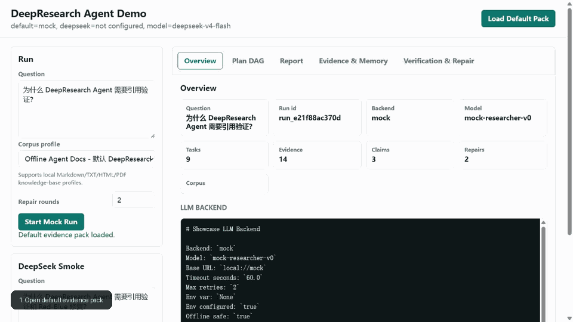
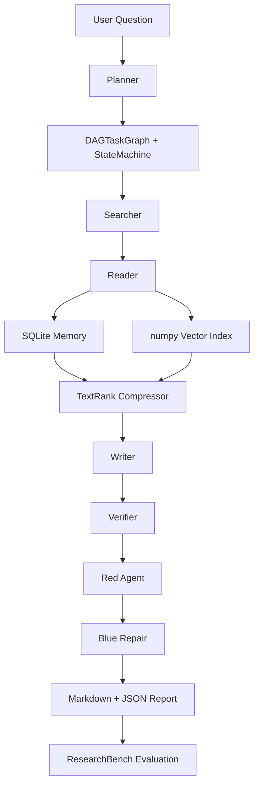

# DeepResearch Agent

[](https://github.com/traMpo1ine/deepresearch-agent/actions/workflows/ci.yml)

面向复杂深度研究任务的多 Agent 可信生成系统。项目重点不是“调一次 LLM 得到回答”，而是把规划、执行、共享记忆、上下文压缩、引用验证、Red-Blue 修复和自动评测做成一个可本地演示、可复现、可追踪的 AI Agent / RAG 工程作品。

当前阶段：portfolio-ready。全链路覆盖 Planner、DAG、Searcher、Reader、SQLite Memory、numpy Vector Index、TextRank、Writer、atomic Verifier、Red-Blue Repair、三层 JSON fallback、Claim Preflight、ResearchBench-style 评测、adversarial suite、DeepSeek verifier benchmark 和本地 Web Demo。

## 30 秒速览

| 维度 | 当前状态 |
|---|---|
| Demo | FastAPI + 静态前端，支持默认 evidence pack 展示和新问题 mock/offline run |
| Agent 编排 | Planner 生成 DAG，Coordinator 按拓扑批次并发执行，TaskStateMachine 记录任务生命周期 |
| 可信生成 | SQLite 共享记忆、numpy vector recall、TextRank 压缩、claim-level citation、atomic Verifier、Red-Blue repair |
| RAG 真实感 | 支持 local corpus profile，可切换 `offline_agent_docs`、`resume_agent_docs`、`paper_reading_docs`、`local_kb_docs` |
| 评测 | 35 题冻结 ResearchBench、10 题 adversarial suite、60 题 extended ablation、80 条 Red-Blue fixtures |
| 真实 API | DeepSeek `deepseek-v4-flash` 只做 provider / verifier showcase，不混入 offline/mock 主指标 |

## Web Demo



静态截图备份：[`docs/assets/web_demo_showcase.png`](docs/assets/web_demo_showcase.png)

## 关键结果

- 60 题 `researchbench_extended.jsonl` ablation：baseline judge mean `0.764` -> full `0.880`，full-baseline `+0.115`。
- weak_support_rate：baseline `1.000` -> full `0.431`，说明 Verifier / Red-Blue 后弱支持 claim 明显减少。
- full repair_precision：`0.944`，repair_coverage：`1.000`。
- Formal DeepSeek verifier benchmark：120 个 balanced claim/evidence cases 重复 3 轮，共 360 次真实判断，accuracy `0.842`，macro-F1 `0.831`。
- 固定 Red-Blue fixtures：80 条 adversarial fixtures，repair_success `0.425 -> 1.000`，repair_precision `1.000`。
- 以上主评测均为 offline/mock benchmark；真实 DeepSeek 输出只作为 provider/verifier 接入证据。

## 3 分钟演示

1. `uv run python scripts/run_demo_server.py`，打开 `http://127.0.0.1:8000` 看默认 evidence pack。
2. 在 Web Demo 选择 `local_kb_docs` 或其他 corpus profile，输入问题，启动一次 mock/offline run，展示 Plan DAG、Evidence & Memory、Verification & Repair。
3. 运行 `uv run python scripts/inspect_resume_metrics.py --json` 或打开 `reports/final/pre_resume_evidence_pack/index.md`，说明指标、formal verifier benchmark 和真实 API 成本边界。

## 证据入口

- 写简历前冻结证据包：[`reports/final/pre_resume_evidence_pack/index.md`](reports/final/pre_resume_evidence_pack/index.md)
- 逐条证据追踪矩阵：[`docs/TRACEABILITY_MATRIX.md`](docs/TRACEABILITY_MATRIX.md)
- 面试讲解与候选 bullet：[`docs/RESUME_NOTES.md`](docs/RESUME_NOTES.md)
- 简历第二项目最终版：[`docs/RESUME_SECOND_PROJECT_FINAL.md`](docs/RESUME_SECOND_PROJECT_FINAL.md)
- GitHub 作品集配置清单：[`docs/GITHUB_PORTFOLIO.md`](docs/GITHUB_PORTFOLIO.md)
- Web Demo 默认 showcase：[`reports/showcase/final_check/index.md`](reports/showcase/final_check/index.md)
- Formal verifier benchmark：[`reports/verifier_benchmark/formal_deepseek_v4_flash_120x3/report.md`](reports/verifier_benchmark/formal_deepseek_v4_flash_120x3/report.md)

## 快速开始

本项目使用 `uv` 管理虚拟环境和依赖：

```powershell
$env:UV_CACHE_DIR='.uv-cache'
uv sync --extra dev
uv sync --extra web --extra dev
```

启动本地 Web Demo，默认访问 `http://127.0.0.1:8000`：

```powershell
uv run python scripts/run_demo_server.py
```

构建本地知识库 corpus profiles：

```powershell
uv run python scripts/build_corpus_profiles.py
uv run python scripts/build_corpus_profiles.py --profile local_kb_docs
uv run python scripts/run_showcase.py "如何把 DeepResearch Agent 写进 AI 应用实习简历？" --corpus-path data/corpus/profiles/resume_agent_docs.jsonl
```

`data/corpus_profiles/local_kb_docs/` 支持 Markdown/TXT/HTML/PDF 混合资料，构建后生成 `data/corpus/profiles/local_kb_docs.jsonl`，用于演示本地企业知识库式 RAG。

```powershell
uv run python scripts/run_research.py "为什么需要对 DeepResearch Agent 做引用验证和 Red-Blue 修复？" --output reports/example.md --output-json reports/example.json
```

生成一份完整展示包，把 Planner、DAG、报告、记忆、压缩、Verifier、Red-Blue 和评测说明串起来：

```powershell
uv run python scripts/run_showcase.py "为什么 DeepResearch Agent 需要引用验证？"
```

默认输出到 `reports/showcase/<timestamp>/`，入口文件是 `index.md`。

Showcase 也支持记录 LLM 后端配置：

```powershell
uv run python scripts/run_showcase.py "为什么 DeepResearch Agent 需要引用验证？" --llm-backend mock --model mock-researcher-v0
uv run python scripts/run_showcase.py "为什么 DeepResearch Agent 需要引用验证？" --llm-backend deepseek
```

展示包会生成 `llm_backend.md`，用于查看 backend、model、base url、env 配置和 run summary 中的后端字段。

真实 DeepSeek API 展示单独运行，默认使用低成本 `deepseek-v4-flash`，并用 `--max-tokens` 限制输出长度：

```powershell
$env:DEEPSEEK_API_KEY='你的 DeepSeek API key'
uv run python scripts/run_deepseek_showcase.py --run-real --max-tokens 512
```

这个命令会生成 `reports/real_api/deepseek_showcase.md`，记录真实输出、token usage 和估算成本。它只是 provider smoke/showcase，不进入正式 offline/mock benchmark 指标。

运行可选 LLM Verifier smoke，默认 dry-run 不调用真实 API；正式冻结结果见 `reports/verifier_benchmark/formal_deepseek_v4_flash_120x3/report.md`：

```powershell
uv run python scripts/run_llm_verifier_smoke.py --json
$env:DEEPSEEK_API_KEY='你的 DeepSeek API key'
uv run python scripts/run_llm_verifier_smoke.py --run-real --limit 10 --json
uv run python scripts/run_formal_verifier_benchmark.py --run-real --model deepseek-v4-flash --repetitions 3 --output-dir reports/verifier_benchmark/formal_deepseek_v4_flash_120x3
```

查看投递包装指标覆盖：

```powershell
uv run python scripts/inspect_resume_metrics.py
```

最新 60 题 extended ablation：run id `20260705_020934_092414_researchbench_263e905e`，baseline judge mean 0.764，full judge mean 0.880，full-baseline +0.115；weak_support_rate 从 1.000 降到 0.431，full repair_precision 0.944，repair_coverage 1.000。该结果覆盖 baseline / verifier / redblue / full profile，仍属于 offline/mock benchmark。

推荐演示顺序：

1. 先运行 `run_demo_server.py` 打开 Web Demo，默认加载 final evidence pack。
2. 在页面输入一个问题，启动 mock/offline run，观察 plan、report、evidence、verification、repair。
3. 再运行 `run_showcase.py` 生成完整展示包，或运行 `run_eval.py` 查看正式离线评测。

运行测试：

```powershell
uv run pytest
```

运行离线评测：

```powershell
uv run python scripts/run_eval.py --dataset data/benchmarks/researchbench.jsonl --experiments baseline,memory,compression,verifier,redblue,full
```

使用配置文件运行默认评测：

```powershell
uv run python scripts/run_eval.py --config configs/default.toml
```

运行对抗评测：

```powershell
uv run python scripts/run_eval.py --suite adversarial --experiments baseline,verifier,redblue
```

查看共享记忆：

```powershell
uv run python scripts/inspect_memory.py --memory-path data/memory/deepresearch.sqlite3
uv run python scripts/inspect_memory.py --memory-path reports/showcase/final_check/memory.sqlite3 --schema --runs --limit 5
```

检查报告里的 claim -> citation -> evidence -> verification -> repair 链路：

```powershell
uv run python scripts/inspect_report_trace.py --report-json reports/showcase/final_check/report.json
```

检查每条简历 bullet 对应的代码、测试、命令和实验产物：

```powershell
uv run python scripts/inspect_resume_evidence.py --list
uv run python scripts/inspect_resume_evidence.py --bullet verifier_redblue
```

只观察 Planner 生成的 DAG，不执行完整研究：

```powershell
uv run python scripts/inspect_plan.py "为什么 DeepResearch Agent 需要引用验证？"
```

对比固定模板和问题自适应 Planner：

```powershell
uv run python scripts/inspect_plan.py "比较 SQLite 和向量数据库的优缺点" --planner-mode template
uv run python scripts/inspect_plan.py "比较 SQLite 和向量数据库的优缺点" --planner-mode heuristic
```

观察上下文压缩与引用保护：

```powershell
uv run python scripts/inspect_compression.py --case quote_preservation
uv run python scripts/inspect_compression.py --case multi_quote_preservation --json
```

观察 SQLite 共享记忆与 numpy 向量召回：

```powershell
uv run python scripts/inspect_memory_trace.py --case sqlite_vector_recall
uv run python scripts/inspect_memory_trace.py --case hybrid_memory_recall --json
```

观察评测指标、Bootstrap CI 和 Cohen's d：

```powershell
uv run python scripts/inspect_eval_metrics.py --case baseline_vs_redblue
uv run python scripts/inspect_eval_metrics.py --case baseline_vs_redblue --json
```

观察 LLM 后端配置：

```powershell
uv run python scripts/inspect_llm_backend.py --backend mock --smoke
uv run python scripts/inspect_llm_backend.py --backend deepseek --json
uv run python scripts/inspect_llm_backend.py --backend deepseek --smoke --max-tokens 64
uv run python scripts/inspect_llm_backend.py --backend vllm --model local-model --vllm-base-url http://localhost:8000/v1 --json
```

观察 V3 timeout/replan/fallback 和 Red-Blue 收敛机制：

```powershell
uv run python scripts/inspect_orchestration_failure.py --case batch_replan
uv run python scripts/inspect_orchestration_stress.py --summary
uv run python scripts/inspect_redblue_convergence.py --case oscillation
uv run python scripts/inspect_structured_output.py --summary
uv run python scripts/run_redblue_eval.py
uv run python scripts/run_backend_smoke_matrix.py
uv run python scripts/run_real_judge_smoke.py --backend mock --limit 5
uv run python scripts/run_eval.py --config configs/default.toml --group-by domain
```

生成最终证据包：

```powershell
uv run python scripts/run_final_experiments.py
```

这个命令会把 showcase、ResearchBench、adversarial、Red-Blue fixtures、Structured JSON fallback、backend smoke、judge smoke 和 completion check 汇总到 `reports/final/<run_id>/index.md`。真实 OpenAI/DeepSeek judge smoke 需要 API key，并且不会进入正式 offline/mock benchmark 指标。

## 架构



默认模式是离线、mock、无网络依赖。真实模型后端只在显式传入 `--llm-backend deepseek|openai|vllm` 并配置环境变量时使用。

## 目录

- `PROJECT_DESIGN.md`：完整项目设计、模块拆分、里程碑。
- `src/deepresearch_agent/agents`：Planner / Searcher / Reader / Writer / Critic / Verifier。
- `src/deepresearch_agent/orchestration`：DAG 编排、状态机、Coordinator。
- `src/deepresearch_agent/memory`：SQLite 共享记忆、numpy 向量索引。
- `src/deepresearch_agent/compression`：TextRank 与上下文压缩。
- `src/deepresearch_agent/redblue`：Red-Blue 对抗与修复动作。
- `src/deepresearch_agent/evaluation`：自动评测、置信区间、效果量。
- `src/deepresearch_agent/llm`：多 LLM 后端适配。
- `src/deepresearch_agent/web`：FastAPI + 静态前端本地 Demo。
- `src/deepresearch_agent/resume_evidence.py`：简历 bullet 到代码/测试/产物的证据映射。
- `data/benchmarks`：ResearchBench / HotpotQA / adversarial 风格样例数据。
- `data/adversarial`：Red-Blue repair fixtures。
- `data/corpus`：离线检索语料，避免早期依赖外网。
- `reports`：生成的研究报告与实验报告。

## 项目原则

- 先做可运行闭环，再逐步替换 mock 组件。
- 每个 Agent 的输入输出都结构化，方便调试、评测和面试讲解。
- 所有关键结论都追踪 evidence 和 citation。
- 每个阶段都保留实验结果，最终形成 README、实验报告和技术博客材料。

## 当前已覆盖的技术点

- Python dataclass / Enum / Protocol 风格接口。
- Template / Heuristic 双 Planner，支持 comparison、risk analysis、solution design 和 general 四类任务图。
- asyncio + Semaphore 并发执行 DAG 拓扑批次。
- 9 状态状态机追踪任务生命周期、timeout、阻塞传播和 recovery trace。
- Planner / Searcher / Reader / Writer / Critic / Verifier / Blue Repair 多 Agent。
- SQLite 共享记忆，保存 runs、tasks、evidence、claims、reports、agent_events。
- numpy hashing embedding index，支持相似 evidence 召回和 save/load。
- TextRank 上下文压缩，保留 citation quote。
- 引用追踪、atomic claim-evidence 验证、best evidence selection、幻觉检测启发式。
- Structured Output Parser 提供严格 JSON、fenced/substring JSON、schema repair 三层 fallback。
- Claim Preflight 在 Writer 阶段做去重、冲突提示和过强断言降级。
- Red-Blue 对抗发现与 ADD / DELETE / MODIFY / VERIFY 修复动作，80 条 adversarial fixtures 回归测试。
- Red-Blue repair loop 收敛/震荡检测，记录每轮 finding、weak claim、action 和 fingerprint。
- ResearchBench-style 35题评测、10题 adversarial suite、domain/HotpotQA-style 多跳子集、mock LLM-as-Judge、Bootstrap 95% CI、Cohen's d。
- Mock、OpenAI-compatible、DeepSeek、vLLM 后端适配骨架和 smoke matrix。
- FastAPI + 静态前端 Web Demo，支持默认 evidence pack 展示、mock run 启动、状态轮询、DeepSeek provider smoke。

## 运行产物

以下内容是运行产物，不作为核心源码资产：

- `.venv/`
- `.uv-cache/`
- `__pycache__/`
- `*.egg-info/`
- `data/memory/*`
- `reports/plans/*`
- `reports/*.json`
- `reports/*.md`

如果怀疑历史产物污染环境，可以删除 `data/memory/` 和 `reports/` 下生成文件后重新运行 `uv run pytest`。

## 清理与复现实验

清理 Python 缓存和 egg-info：

```powershell
uv run python scripts/clean_artifacts.py --keep-examples
```

连同运行 memory、plans、临时 reports 一起清理：

```powershell
uv run python scripts/clean_artifacts.py --include-memory --include-plans --include-reports --keep-examples
```

从干净状态复现实验：

```powershell
uv run pytest
uv run python scripts/run_research.py "test question" --memory-path data/memory/local_check.sqlite3
uv run python scripts/run_eval.py --dataset data/benchmarks/researchbench.jsonl --experiments baseline,verifier,redblue
uv run python scripts/run_eval.py --suite adversarial --experiments baseline,verifier,redblue
```

默认评测输出会写入 `reports/experiments/<timestamp>/`，包括 `metrics.json`、`summary.md` 和 `failure_cases.md`。

## 配置化实验

`configs/default.toml` 现在同时管理单题 research 和批量 eval 的默认参数：

- `[evaluation]`：dataset、suite、experiments、bootstrap samples。
- `[memory]`：SQLite 和 vector index 默认路径。
- `[pipeline]`：plan 输出目录。
- `[[experiments.profiles]]`：baseline/memory/compression/verifier/redblue/full 的开关组合。

CLI 参数优先级固定为：命令行参数 > config 文件 > 代码默认值。例如：

```powershell
uv run python scripts/run_eval.py --config configs/default.toml --suite all --experiments baseline,redblue
```

`run_eval.py` 会在写入 `metrics.json` 前校验每个 result 的字段完整性，并检查 summary 均值是否能由 result 明细重新计算出来。

`configs/default.toml` 是当前主配置；`experiments/*.yaml` 只作为轻量实验模板或历史兼容参考，日常运行优先使用 `run_eval.py --config configs/default.toml`。

## 真实 LLM 后端

默认后端是 `mock`，用于离线学习、测试和正式 mock benchmark。真实 LLM 后端只作为可选 smoke：

- OpenAI：读取 `OPENAI_API_KEY`。
- DeepSeek：读取 `DEEPSEEK_API_KEY`，复用 OpenAI-compatible 协议；默认模型为 `deepseek-v4-flash`，用于低成本真实 API showcase。
- vLLM：默认 base url 为 `http://localhost:8000/v1`，读取 `VLLM_API_KEY`。

无 key 时可以 dry-run 检查配置，不访问网络：

```powershell
uv run python scripts/inspect_llm_backend.py --backend deepseek --json
uv run python scripts/inspect_llm_backend.py --backend vllm --model local-model --vllm-base-url http://localhost:8000/v1 --json
```

有 key 时才运行真实 smoke：

```powershell
uv run python scripts/inspect_llm_backend.py --backend openai --model gpt-4o-mini --smoke
uv run python scripts/inspect_llm_backend.py --backend deepseek --smoke --max-tokens 64
uv run python scripts/run_deepseek_showcase.py --run-real --max-tokens 512
```

真实 LLM 输出不能和 offline/mock benchmark 指标混写。DeepSeek showcase 会额外记录 token usage 和估算成本，用于展示后端接入与成本控制。

## 本地 Web Demo

Web Demo 是面试和作品展示入口，默认读取已有 final evidence pack，也支持启动新的 mock/offline run：

```powershell
uv sync --extra web --extra dev
uv run python scripts/run_demo_server.py
```

页面包含五个区块：

- Overview：run id、backend、模型、任务数、证据数、修复数。
- Plan DAG：任务列表与 Mermaid DAG 文本。
- Report：报告 Markdown 与结构化 claims。
- Evidence & Memory：evidence、quote、source、memory trace。
- Verification & Repair：atomic verifier trace、Red-Blue actions、repair loop。

API 入口：

- `GET /api/health`
- `GET /api/showcase/default`
- `POST /api/runs`
- `GET /api/runs/{run_id}`
- `GET /api/runs/{run_id}/artifacts`
- `POST /api/deepseek-showcase`

新 run 默认只允许 `backend="mock"`。DeepSeek 真实调用只通过 `/api/deepseek-showcase` 显式触发，并且只从环境变量读取 `DEEPSEEK_API_KEY`。

## 最终质量门

```powershell
uv run ruff check src tests scripts
uv run pytest
uv run python -m compileall src scripts tests
uv run python scripts/run_showcase.py "为什么 DeepResearch Agent 需要引用验证？"
uv run python scripts/run_eval.py --config configs/default.toml --experiments baseline,redblue,full
uv run python scripts/run_eval.py --suite adversarial --experiments baseline,verifier,redblue
uv run python scripts/check_project_completion.py
```

Web Demo 需要手动启动后在浏览器检查：`uv run python scripts/run_demo_server.py`。

## 学习材料

- [Learning index](docs/LEARNING_INDEX.md)：按“读什么、跑什么、看什么输出”组织完整学习路线。
- [Project completion log](docs/PROJECT_COMPLETION_LOG.md)：按阶段记录项目从骨架到收尾的完成过程、难题和解决方案。
- [Final completion checklist](docs/FINAL_COMPLETION_CHECKLIST.md)：判断项目是否达到复试可讲、简历可写、长期可维护的完成态。
- [Final project report](docs/FINAL_PROJECT_REPORT.md)：项目最终报告，汇总架构、模块完成情况、正式实验结果和边界。
- [Build log](docs/BUILD_LOG.md)：记录每次关键优化的问题、方案、验证和面试故事。
- [Interview QA](docs/INTERVIEW_QA.md)：整理 Planner、Searcher、Verifier、Red-Blue、Evaluation 的面试问答。
- [Traceability matrix](docs/TRACEABILITY_MATRIX.md)：把每条简历 bullet 映射到代码、测试、命令、实验产物和边界。
- [Final resume project](docs/RESUME_SECOND_PROJECT_FINAL.md)：第二项目最终简历 bullet、3 分钟讲稿和投递边界。
- [GitHub portfolio checklist](docs/GITHUB_PORTFOLIO.md)：仓库 description、topics、public visibility 和 first-click route。
- [Core schemas](docs/learning_core_schemas.md)：解释 `ResearchTask`、`ResearchPlan`、`Evidence`、`Claim` 等核心对象。
- [Adaptive planner](docs/learning_adaptive_planner.md)：解释 Template Planner 与 Heuristic Planner 如何生成不同 DAG。
- [Orchestration trace](docs/learning_orchestration_trace.md)：解释一次 run 如何从 Planner 走到 DAG、Coordinator 和 Memory。
- [Searcher grounding](docs/learning_searcher_grounding.md)：解释为什么 Planner 拆得对还不够，Searcher 必须找准证据。
- [SQLite memory](docs/week05_memory.md)：解释 SQLite 如何保存可审计运行轨迹。
- [SQLite migration](docs/learning_sqlite_migration.md)：解释轻量 schema migration、旧库补列和 schema version。
- [Numpy vector retrieval](docs/week06_vector_retrieval.md)：解释 numpy 向量索引如何召回 evidence id。
- [TextRank compression](docs/week07_textrank_compression.md)：解释 L1/L2/L3 上下文压缩与引用保护。
- [Verifier atomic claims](docs/learning_verifier_atomic_claims.md)：解释 atomic claim、best evidence 和 verification trace 怎么读。
- [Red-Blue fixtures](docs/learning_redblue_fixtures.md)：解释 Red finding 和 Blue repair action 如何触发。
- [Evaluation metrics](docs/learning_evaluation_metrics.md)：解释 judge mean、Bootstrap CI、Cohen's d 和评测完整性。
- [Config and backend](docs/learning_config_backend.md)：解释配置优先级和多 LLM 后端适配。
- [Orchestration fallback](docs/learning_orchestration_fallback.md)：解释 timeout、lightweight replan 和 fallback report。
- [Red-Blue convergence](docs/learning_redblue_convergence.md)：解释 repair loop 收敛与震荡检测。
- [Day 02 plan example](docs/generated/day02_plan.md)：固定问题的 DAG 观察样例。
- [Day 03 verifier trace](docs/generated/day03_verifier_trace.md)：固定 mixed atomic 样例的 Verifier trace。
- [Day 04 red-blue trace](docs/generated/day04_redblue_trace.md)：固定 overclaim 样例的 Red-Blue 修复轨迹。
- [Day 05 compression trace](docs/generated/day05_compression_trace.md)：固定 quote preservation 样例的压缩轨迹。
- [Day 06 memory trace](docs/generated/day06_memory_trace.md)：固定 SQLite + vector recall 样例的记忆轨迹。
- [Day 07 eval metrics trace](docs/generated/day07_eval_metrics_trace.md)：固定 baseline vs redblue 样例的评测指标轨迹。
- [Day 08 LLM backend trace](docs/generated/day08_llm_backend_trace.md)：固定 mock smoke 和真实后端 dry-run 样例。
- [Day 09 orchestration failure trace](docs/generated/day09_orchestration_failure_trace.md)：固定 timeout/replan/fallback 样例。
- [Day 10 red-blue convergence trace](docs/generated/day10_redblue_convergence_trace.md)：固定 convergence/oscillation 样例。
- [Day 11 orchestration stress trace](docs/generated/day11_orchestration_stress.md)：固定 timeout/retry/replan/fallback 压力样例。
- [Day 12 structured output trace](docs/generated/day12_structured_output_trace.md)：三层 JSON fallback 样例统计。

## 精选样例

- [Offline v2 example](reports/examples/offline_v2_example.md)

## 当前实验结果

最近一次 offline/mock V3 收尾实验：

- Pre-resume evidence pack：`reports/final/pre_resume_evidence_pack/index.md`，冻结写简历前的 60 题 ablation、formal verifier benchmark 和 Web Demo 截图。
- Final evidence pack：`reports/final/final_sprint_check/index.md`。
- Final sprint ResearchBench full：judge mean 0.880，95% CI `[0.858, 0.903]`，hallucination_rate 0.000，repair_precision 0.895，repair_coverage 1.000。
- Final sprint adversarial redblue：judge mean 0.920，95% CI `[0.893, 0.950]`，repair_precision 0.883，repair_coverage 1.000。
- ResearchBench 主集：35 题，11 个 domain，13 个 multi-hop case，6 个 Hotpot-style case，run id `20260702_162345_148429_researchbench_21c535de`。
- Adversarial suite：10 题，7 个 multi-hop case，run id `20260702_163315_852511_adversarial_f47f9b96`。
- Extended ResearchBench ablation：60 题，run id `20260705_020934_092414_researchbench_263e905e`，baseline judge mean 0.764 -> full 0.880，weak_support_rate 1.000 -> 0.431，full repair_precision 0.944，repair_coverage 1.000。
- ResearchBench full：judge mean 0.881，95% CI `[0.859, 0.903]`，hallucination_rate 0.000，weak_support_rate 0.490。
- ResearchBench full：repair_precision 0.886，repair_coverage 1.000，repair_convergence_rate 1.000，repair_oscillation_rate 0.514。
- Adversarial redblue：judge mean 0.913，95% CI `[0.890, 0.940]`，repair_precision 0.933，repair_coverage 1.000，repair_oscillation_rate 0.300。
- Structured JSON fallback：50 条 corrupted-output cases，parse_success_rate 1.000，Level 1/2/3 分布为 6/11/33。
- Red-Blue fixtures：80 条 adversarial fixtures，repair_success_before 0.425，repair_success_after 1.000，action_accuracy 1.000，repair_precision 1.000，repair_coverage 1.000。
- Formal DeepSeek verifier benchmark：120 个 balanced claim/evidence cases 重复 3 轮，共 360 次真实判断，accuracy 0.842，macro-F1 0.831，heuristic baseline accuracy 0.467，估算成本 RMB 0.05893803；只代表 verifier 分类实验，不代表端到端 DeepResearch 质量。
- Backend smoke matrix：默认只 smoke mock，真实 OpenAI/DeepSeek/vLLM 在无 key 时 dry-run，不进入 offline benchmark 指标。

这些数字只代表本项目 offline/mock benchmark 内部对比，不代表线上或真实用户场景。

## 面试材料

- [Resume notes](docs/RESUME_NOTES.md)
- [Experiment notes](docs/EXPERIMENTS.md)
- [Post-exam study plan](docs/POST_EXAM_STUDY_PLAN.md)
