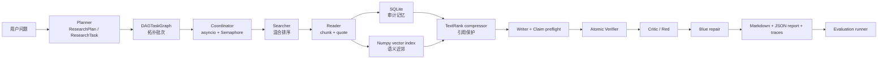

# DeepResearch Agent：实习面试深挖学习讲义

> 目标：不是背项目名词，而是能从需求、架构、代码、算法、实验、缺陷与演进方案六个层面回答追问。
>
> 本讲义以当前源码为准。它会明确区分“已经在主链路运行的能力”“独立 showcase / benchmark 能力”和“未来可扩展方向”。这是面试中最重要的可信度来源。

## 0. 先建立正确的项目认知

### 0.1 一句话版本

这是一个**离线优先、可复现、可追踪的复杂调研 Agent 原型**：把问题拆成带依赖的任务图，从本地语料检索并抽取证据，以 `claim -> citation -> source chunk -> quote` 的链路生成报告；再用 claim 级验证和 Red-Blue 修复记录不可靠内容如何被发现、修改或删除，最后用冻结数据集评估各模块的收益。

### 0.2 它要解决的不是“模型会不会回答”，而是什么

普通 RAG Demo 的最小链路是：问题 -> 检索 Top-k -> LLM 回答。它的常见问题是：

1. 复杂问题缺少分解，所有检索词混在一次查询中；
2. 回答有引用但引用不一定支持具体断言；
3. 出错后只得到一段文本，不能定位是规划、检索、写作还是验证失败；
4. 接了更多模块却没有对照实验，无法说明改进是否真实存在；
5. 实时调用模型会造成成本、随机性、回归测试不稳定。

本项目分别用 DAG 编排、结构化 schema、持久化 trace、Verifier/Red-Blue 和 offline/mock benchmark 应对这些问题。

### 0.3 面试中的诚实边界（必须背）

- 主流水线默认是 **本地 corpus + mock/启发式算法**，可以离线稳定复现；不是生产线上多用户 Deep Research 服务。
- `Planner` 当前是模板/关键词启发式规划，不是由真实 LLM 动态推理的 planner。
- `Writer` 当前是结构化、确定性的模板化报告生成器；主 `Coordinator` 中虽创建了 LLM backend，但并未把它直接用于 planner、writer 或 heuristic verifier 的生成推理。
- 主向量检索使用 64 维 hashing vector + numpy cosine similarity，是轻量 baseline，不是 embedding 模型或 FAISS/向量数据库。
- DeepSeek 接入真实存在，但主要用于 OpenAI-compatible provider / verifier showcase 与独立 120 条 claim-evidence 分类基准；**不能把该指标说成端到端线上效果**。
- 当前 Web Demo 面向本地作品展示，没有鉴权、多租户、限流、在线上传和企业权限体系。

这不是自曝短板。正确表达是：我先把可观测、可复现的工程基线做稳定，再把真实模型替换为遵守相同 schema 的组件，避免先堆模型调用后失去可测试性。

## 1. 总架构与真实执行链路



### 1.1 一次 run 的时间顺序

1. `ResearchCoordinator.run(question)` 创建 `run_id`，将配置、问题和开始时间写入 SQLite 的 `runs`。
2. `PlannerAgent` 输出 `ResearchPlan`：根节点、多个 Search 子任务、以及逻辑上的 synthesize/verify/repair 节点。
3. `DAGTaskGraph` 校验依赖节点存在、无环，并按拓扑层生成 batch。
4. Coordinator 对同一层可执行任务用 `asyncio.gather` 提交；`asyncio.Semaphore(max_concurrency)` 限制同时执行数量。真正产生 evidence 的是 Search 任务：`Searcher -> Reader`。
5. 每个证据块同时写 SQLite，并写入 NumpyVectorIndex；失败任务会重试，最终失败可触发 recovery search。依赖失败的下游节点标记为 blocked。
6. 合并历史召回结果、去重、可选补充检索；TextRank 将长 evidence 压缩成 context，但强制保留 quote。
7. `WriterAgent` 产生带 `citation_ids` 的 `Claim` 和结构化 `ResearchReport`；`ClaimPreflight` 先做低成本的重复/冲突/过强断言检查。
8. `VerifierAgent` 逐 claim 拆 atomic claims，为每条 citation evidence 打分，输出 supported/partial/unsupported/contradicted 及 trace。
9. `CriticAgent` 从引用缺失、事实性、遗漏等角度生成攻击发现；`BlueRepairAgent` 对应记录 ADD/DELETE/MODIFY/VERIFY 修复动作。
10. report、claims、verification traces、repair actions、agent events 统统写回 SQLite，并输出 Markdown/JSON。评测 runner 在不同 profile 下重复运行并汇总指标。

### 1.2 一个容易被问穿的实现细节

规划图中的 `SYNTHESIZE` / `VERIFY` / `REPAIR` 任务节点，当前在 `_execute_task` 中不产生 evidence；写作、验证和修复是在搜索任务全部完成后由 Coordinator 的后续阶段真正执行。因此它当前是“**DAG 描述了完整研究流程，但 DAG 内真正并发的执行单元主要是 search/read**”。

面试可答：这是原型阶段的分层选择。把后处理放在 Coordinator 中便于让 writer 拿到全量 evidence，并保证 verify/repair 一定发生在完整报告之后。下一步会把它们改成显式 artifact 输入输出的 DAG task，使每个阶段可独立重试、缓存和分布式调度。

## 2. 模块一：Schema 与 Agent 基类——为什么先“结构化”

关键数据对象集中在 `src/deepresearch_agent/schemas/core.py`，使用 `dataclass(slots=True)`。`slots=True` 限制对象可随意新增属性，节省内存，并更早暴露字段拼写错误。

核心对象关系：

| 对象 | 它回答的问题 | 关键字段 |
| --- | --- | --- |
| `ResearchTask` | 要做什么、依赖谁、目前状态？ | `question/dependencies/status/retry_count/timeout_seconds` |
| `ResearchPlan` | 如何把大问题拆开？ | `tasks/rationale/plan_type/quality_report` |
| `Evidence` | 这条材料从哪来、可否定位？ | `source_id/chunk_id/text/quote/quote_start/quote_end/score` |
| `Claim` | 报告中哪句话需要被证明？ | `text/citation_ids/status/confidence/trace` |
| `VerificationTrace` | 为何判定支持或不支持？ | terms、overlap、contradiction cues、atomic results |
| `RepairAction` | 怎样改的、改前后是什么？ | `action_type/target_claim_id/reason/before/after` |
| `ResearchReport` | 面向用户和评测的最终产物 | claims/evidence/sections/limitations/run_summary |

**为什么不用字典从头传到尾？** 字典快，但字段约束很弱：可能把 `citation_id` 写成 `citation_ids`、把字符串当 Evidence 传入，错误在很后面才爆。schema 把 Agent 的接口变成契约，例如 Reader 的输入必须是 `{task: ResearchTask, results: list[SearchResult]}`。这也是多 Agent 系统能测试的前提。

`BaseAgent.run` 的价值是统一返回 `AgentResult`：`agent_name/ok/output/latency_seconds/error/metadata`。Coordinator 不依赖某个 Agent 的异常风格，而是统一把事件持久化为 `agent_events`。面试官问“如何可观测”时，先讲这个统一外壳，再讲 SQLite。

## 3. 模块二：Planner——从问题到 DAG

`PlannerAgent` 有两种模式：

- `template`：固定覆盖 background、implementation、risk、evaluation、tradeoffs，用作弱但稳定的 baseline；
- `heuristic`：用关键词分类为 `GENERAL/COMPARISON/RISK_ANALYSIS/SOLUTION_DESIGN`，再调用不同 subtask builder。

以“比较 SQLite 与向量数据库”为例：分类器命中“比较”，产生概念界定、选项 A、选项 B、比较与推荐四类子问题；最后一项依赖前三项，因此这是一个真正的扇入（fan-in）节点。

### 3.1 Plan quality 是什么

`assess_quality` 不是判定研究结论正确，而是做 planner 的**结构性静态检查**：任务数是否足够、是否有依赖、当前问题类型要求的 coverage 是否出现。它类似编译器的 lint，不替代事实验证。

### 3.2 追问：为什么 Planner 不用 LLM？

建议回答：早期先需要一个 deterministic baseline。LLM planner 的输出不稳定、难复现，容易让后续检索/评测差异无法归因。我保留 `ResearchPlan` schema 和 planner mode；接 LLM 时只需让它输出受 schema 校验的 plan，并配置 fallback 到 heuristic planner。真正生产化时还会加 task budget、来源约束、plan validator 和 replan policy。

## 4. 模块三：DAG、状态机与 asyncio 编排

### 4.1 DAG 是什么，为什么不是队列

有向无环图 G=(V,E)：节点是任务，边表示“B 必须等 A 完成”。普通 FIFO 队列无法天然表达并行和依赖；DAG 可以执行：

```text
batch 0: root
batch 1: search_1, search_2, search_3  # 互不依赖，可并行
batch 2: comparison                     # 等前三项完成
```

`DAGTaskGraph` 建立：

- `tasks: id -> ResearchTask`
- `children: parent_id -> [child_id]`
- `indegree: 每个节点尚未满足的依赖数`

它用 **Kahn 拓扑排序** 检测环：从入度 0 的节点开始，不断删除它的出边。若最终弹出的节点数小于总节点数，说明剩余节点互相依赖，抛 `DAGCycleError`。时间复杂度 O(|V|+|E|)。

### 4.2 状态机为何必要

任务不是只靠 `done=True/False`。项目定义了：

`PENDING -> READY -> RUNNING -> SUCCEEDED -> VERIFIED`

异常路径还包括 `FAILED`、`TIMED_OUT`、`BLOCKED`、`REPAIRING`。`TaskStateMachine` 将合法迁移写成显式表，非法跃迁直接报错。好处：

- 不能从 PENDING 直接标成 SUCCEEDED；
- timeout 可以 READY 后重试，最终转 FAILED；
- 下游依赖失败时能解释为 BLOCKED，而不是误报为成功；
- trace 可以给出每次失败第几次 attempt。

### 4.3 asyncio + Semaphore 的正确解释

`asyncio.gather(*(…))` 创建同层任务的协程并等待它们结束；`async with self.semaphore` 控制进入实际执行区的数量。设并发上限为 k，不代表一定有 k 个 CPU 线程：它是单线程事件循环下的**协作式并发**，特别适合 I/O 等待（HTTP、磁盘、数据库）。

当前 Searcher 主要是本地 CPU 计算，因而并发带来的实际吞吐增益有限；如果接 Tavily/LLM/远程数据库，Semaphore 才会显著避免连接数、速率和成本失控。这个判断能体现你没有把 asyncio 当万能加速。

### 4.4 容错路径

每个 task 有 `max_retries + 1` 次机会。搜索读取被 `asyncio.wait_for(..., timeout=task.timeout_seconds)` 包裹：超时进入 `TIMED_OUT`，未超时时的普通异常进入 `FAILED`。到达阈值时 Coordinator 创建一条依赖相同的 `Recovery search for failed task`，以较低复杂度补证据；若 evidence 总量低于 `min_evidence_count`，报告会附带 fallback limitation。

追问“retry 的风险？”：无差别重试可能放大外部 API 压力、重复花钱、在永久错误上浪费时间。生产版应按错误类别处理：429/5xx 指数退避+抖动，4xx 参数错误不重试；幂等键防重复写；分别设 task deadline 和 run deadline。

## 5. 模块四：Searcher 与 Reader——RAG 的“R”和可引用证据

### 5.1 Searcher 的当前混合排序

Searcher 读取 JSONL corpus。每个文档有 id/title/text/url，补充 `source_type/topics/trust_level`。查询会先分词并做规则扩展，例如“引用”扩展为 `citation/evidence/source/quote`。

每文档计算：

```text
hybrid_score = lexical_score + 0.20 * vector_score + topic_score
```

- `lexical_score`：简化 TF-IDF。`idf=log((N+1)/(df+1))+1`，再按文本长度平方根归一；适合精确术语。
- `vector_score`：64 维 hashing 向量的内积。向量归一化后等于 cosine similarity；适合有限的词袋近似相关性。
- `trust_level` 不再直接加进相关性分数，只用于同分 tie-break，避免“可信但不相关”的来源挤入 Top-k。0.20 的向量权重来自冻结集校准；同一数据用于校准和评测，因此只称为仓库回归基线，不称为泛化结论。
- `topic_score`：query term 命中 metadata topic 的小幅加分。
- `trust_score`：高/中/低来源分别给 +0.05/0/-0.05。

取 Top-5；没有任何正分时退回前三份文档，确保离线 demo 不会空输出。这是产品鲁棒性取舍，但会降低“没有证据”信号的纯度，生产中应把 fallback 明确标记为低置信候选。

### 5.2 hashing vector 不是 embedding

`NumpyVectorIndex.embed_text` 对每个空格分出的 token 做 SHA-256，再取模映射到 64 个 bucket，计数后 L2 归一化。这是无训练、零 API 成本、可复现的 Hashing Trick baseline。它的缺点是哈希碰撞、无语义同义词能力、中文 token 处理较弱、维度固定很低。因此只能称“轻量向量召回”，绝不能称“语义 embedding 模型”。

升级路径：中文/多语 embedding（如 bge-m3）-> FAISS/HNSW -> hybrid BM25 + dense retrieval -> cross-encoder rerank；但 SQLite 仍保留为审计事实库。

### 5.3 Reader 做了什么

Reader 把每条检索结果按句子切分，累积到约 420 字符的 chunk；每 chunk 抽一条 quote（优先 Searcher 给出的最佳 snippet，否则首句）。它记录 `chunk_id` 和 `quote_start/quote_end`，并用 `(source_id, quote)` 去重。这一步将“检索到一篇文档”转成“哪一个片段支持哪一句话”，是 citation trace 能落地的关键。

**RAG 面试高频误区**：citation 并不自动代表真实性。它至少要满足三个层级：

1. citation 是否存在；
2. citation 是否可定位到原文 chunk/quote；
3. chunk 是否蕴含该 claim，而不是只共享关键词。

本项目前两层较强，第三层在主链路是启发式近似，DeepSeek formal verifier 提供独立的二级实验补充。

## 6. 模块五：SQLite 共享记忆与 Numpy 近邻索引

SQLite 是**可审计、关系型的事实记忆**。表包括 `runs/tasks/evidence/claims/reports/agent_events/verification_traces/repair_actions/schema_migrations`。每次 agent 调用留下耗时、成功状态、错误和 metadata；每个 claim 可找到 evidence 与 verification trace；每次 repair 可看到 before/after。

向量索引是**模糊召回索引**：`ids + vectors` 保存为 `.npz`，用 `vectors @ query_vector` 排序。Coordinator 会从它召回历史 evidence，再通过 SQLite 取回完整 Evidence。两者不是替代关系：

| 需求 | SQLite | 向量索引 |
| --- | --- | --- |
| “某 run 的所有失败任务” | 强 | 不适合 |
| “claim c 的 quote 是什么” | 强 | 不适合 |
| “找和当前问题语义相似的历史材料” | 弱（当前仅简单文本匹配） | 强 |
| 事务、迁移、审计 | 强 | 弱 |
| 近邻搜索性能 | 小数据够用 | 当前暴力 numpy，规模大时弱 |

### 6.1 为什么不用纯向量库

因为 Agent 不只有文本。任务状态、重试次数、claim、repair action、run 元数据都需要精确查询、事务和持久化；向量库难以替代审计关系。相反，单 SQLite 又不擅长高维近邻检索。所以是“**SQLite 负责事实与追踪，vector index 负责候选召回**”。

### 6.2 一致性风险及改进

当前写入 SQLite 和向量 `.npz` 不是原子事务：进程在两者中间崩溃，可能 SQLite 已有 evidence、索引未更新；或者索引损坏。项目已经在加载 index 失败时告警并重建空索引，但生产版应记录 index version / watermark，增量重建，或采用支持 metadata filter 和持久化的向量数据库，并把 outbox/异步索引任务做幂等。

## 7. 模块六：TextRank 压缩——为什么压缩还要保护引用

LLM 上下文有限且有成本，直接把所有 chunk 喂进去会稀释重点、增大幻觉空间。TextRank 将句子视为图节点，句间相似度为边权，迭代：

```text
S_i = (1-d)/N + d * sum_j (w_ji / sum_k w_jk) * S_j
```

其中 d=0.85。语义上，连接到许多“重要句”的句子更重要，类似 PageRank。

本项目不是直接 TextRank，而是三段：

1. L1：问题向量与句向量相似度筛选到前 `l1_top_k=16`；
2. L2：对候选句运行 TextRank；
3. L3：如果证据有 quote，即使没排进前 12 句也强制保留，标记 `preserved_quote=True`。

最后一步很关键：如果压缩只保留“摘要最佳句”，Writer 的 citation 可能指向已经丢失的关键原文，造成报告可读但不可验证。引用保护以一点 token 预算换取证据链完整。

局限：当前句向量还是 hash bag-of-words，TextRank 没有真正语义理解；强制保留每个 quote 可能超预算。生产中需要 token-aware budget、来源多样性约束、MMR 去冗余和“保留已被 claim 引用的原文”策略。

## 8. 模块七：Writer、Claim Preflight 与 Verifier

### 8.1 Writer 为什么不是自由生成

当前 `WriterAgent` 基于 plan type 选择结构化 sections 和 claim 模板，并按关键词从 evidence 选 citation。这样设计的意义是让离线评测稳定、让每次输出都有 schema；不是为了模拟自然语言模型能力。它的输出来到 `ResearchReport`，Markdown 与 JSON 可互相对应。

`ClaimPreflight` 位于 writer 后 verifier 前，是廉价的第一道防线：发现重复 claim、证据冲突、过强绝对化断言，就先降低措辞或记 limitation。类比软件工程：它是 lint，不是运行时证明。

### 8.2 Atomic Verifier 的具体判定

一个长 claim 往往含多条事实，例如“SQLite 持久化 trace，且默认支持分布式多节点调度”。整句可能有一半对一半错。`split_atomic_claims` 用连接词和分号切分，针对每个 atomic claim：

1. 只在该 claim 的 cited evidence 中选择候选；无有效 citation 直接 unsupported；
2. 抽取重要词（过滤 stopwords）；
3. 对每条 evidence 计算：

```text
score = 0.65 * term_overlap + 0.25 * quote_overlap + 0.10 * source_trust
```

4. 选最佳 evidence，`term_overlap >= 0.35` 为 supported，介于 0 和 0.35 为 partial，0 为 unsupported；
5. 额外检查绝对词与保留词（always vs not always）、数量冲突、中文否定等 contradiction cue；
6. 聚合 atomic 状态：有 contradicted 则整体 contradicted；全 supported 才 supported；混合则 partial。

Trace 保存 matched evidence、support/missing terms、quote overlap、所有 evidence scores、判定原因。因此你不能说“Verifier 调了一个模型判断”，应说“主链路是**可解释的启发式对齐器**”。

### 8.3 阈值 0.35 为什么这么定？

当前它是原型中的经验阈值，应通过验证集调参而不是声称理论最优。面试可补充升级方案：把标注 claim-evidence 划分 train/validation/test，在 validation 上画 PR 曲线，并依据业务目标选择阈值（高风险场景优先 recall，把更多候选送人工/LLM 二审；低成本场景可提高 precision）。

关键词重叠的典型误判：否定关系、同义改写、因果强度、时间范围、数字上下文都可能不靠重叠解决。这正是要做 NLI/LLM verifier、来源质量控制和人工抽检的原因。

## 9. 模块八：Red-Blue 修复闭环

这个命名来自红队/蓝队安全思想：Red 不负责给出好答案，而负责攻击可靠性；Blue 根据可执行动作修复。

`CriticAgent` 当前检查：

- 没有 citation 的 claim（severity 4）；
- verifier 为 unsupported/contradicted 的 claim（severity 4）；
- partial 且尚未修改的 claim（severity 1 或 2）；
- 高分 evidence 没有在 claim 中使用（report-level omission）。

`BlueRepairAgent` 当前行为是确定性的：严重无引用/不支持/矛盾则 DELETE；partial 则在前面加 `Evidence suggests that ...` 并降低 confidence，记录 MODIFY；报告级遗漏会 ADD limitation；已通过时可记录 VERIFY。

### 9.1 为什么记录收敛与震荡

repair loop 最多运行 `repair_rounds=2`。每轮计算 claim 文本的 fingerprint；若修完后又回到历史 fingerprint，或连续修改同一 claim，则判 `OSCILLATION`。停止条件有 `CONVERGED/OSCILLATION/MAX_ROUNDS`。

注意：当前 `converged = weak_after_repair >= weak_before and not severe_findings` 的含义更接近“没有继续改善且不存在严重问题时停止”，命名容易被误解为质量已最好。更严谨的下一版应该改成：无 findings，或连续两轮弱 claim 数不再下降，或收益小于阈值，并把指标命名为 `no_improvement_stop`。

### 9.2 ADD/DELETE/MODIFY/VERIFY 的设计理由

- ADD：补证据或补 limitation；
- DELETE：证据不足时宁可删，避免越修越幻觉；
- MODIFY：将强断言降级为证据允许的限定表达；
- VERIFY：记录已检查而无需改动。

固定动作空间优点是可审计、可评测、低风险；缺点是修复表达能力有限。接 LLM 修复时应把 action schema 固定、要求引用 id、先 sandbox validate，再应用 patch。

## 10. 模块九：LLM provider 与 structured output

`LLMBackendConfig` 把 mock/openai/deepseek/vllm 统一到 `LLMBackend` 接口。OpenAI-compatible adapter 用 `/chat/completions` 和 `/embeddings`，API key 只从环境变量读取，带 timeout 与 retry，并记录 token usage 和成本估算。没有 key 时不会伪装为真实调用。

DeepSeek 的真实 benchmark 用 `deepseek-v4-flash`，执行 120 条均衡 claim/evidence case，重复 3 轮共 360 次。结果：accuracy 0.842、macro-F1 0.831；其中 partial 类 recall 0.500，说明“部分支持”是最难分类的类别。这比只报一个 accuracy 更专业。

不能说“我主系统完全接入 DeepSeek 让各 Agent 自主协作”。准确说法：我设计了 provider abstraction 和真实调用 smoke/benchmark，主链路仍以 offline/mock 保证工程回归稳定；下一步让 LLM planner/writer/repair 通过 structured output schema 逐步替换启发式模块。

**Structured output 的八股**：提示模型输出 JSON 不等于得到可靠 JSON。需要 `json.loads` 严格解析、从 Markdown code fence 提取、修复常见引号/逗号错误、填 schema defaults、Pydantic/JSON Schema 校验、失败时降级；还要区分“格式合法”与“语义真实”。

## 11. 模块十：评测——怎样证明模块有价值

### 11.1 实验设计

`configs/default.toml` 定义 profile：

| profile | memory | compression | verifier | redblue | planner |
| --- | ---: | ---: | ---: | ---: | --- |
| baseline | 否 | 否 | 否 | 否 | template |
| memory | 是 | 否 | 否 | 否 | heuristic |
| compression | 是 | 是 | 否 | 否 | heuristic |
| verifier | 是 | 是 | 是 | 否 | heuristic |
| redblue/full | 是 | 是 | 是 | 是 | heuristic |

它属于 component ablation：控制问题集与多数配置，逐步加入模块，观察指标变化。严格说 baseline 同时改了 planner mode，因此“只归因于 memory”的结论需要谨慎；更严谨的消融应固定 planner，再单独切 memory。

### 11.2 指标不能只报 judge score

- `citation_coverage`：claim 是否挂 citation；
- `hallucination_rate / unsupported_claim_rate / weak_support_rate`：弱支撑风险；
- `atomic_support_rate`：拆开的细粒度断言支持比例；
- `repair_precision`：触发修复中真正合理修复的比例；
- `repair_coverage`：应该修的是否覆盖；
- `evidence_grounding_score`、失败案例：不要让平均分掩盖系统性问题；
- `Bootstrap 95% CI`：对题目重采样得到均值的置信区间，体现样本波动；
- `Cohen's d`：均值差相对 pooled 标准差的效应量，d=(mean_after-mean_before)/pooled_std。

冻结 extended 60 题结果：baseline judge mean 0.764，full 0.880，差值 +0.115；weak_support_rate 从 1.000 到 0.431；full repair_precision 0.944、repair_coverage 1.000。正确结论是：在本项目的**offline/mock 固定评测集**上，full profile 相较 baseline 表现更好；不能推断真实用户效果或模型事实性保证。

固定 80 条 Red-Blue fixtures 中 repair_success 0.425 -> 1.000、repair_precision 1.000，主要验证“既定攻击模式下修复规则是否按预期执行”，而不是证明开放世界的泛化能力。

### 11.3 LLM-as-a-Judge 的追问

Judge 很方便但有偏好、位置偏差、与被评模型同源、对长答案不稳定等问题。缓解方式：冻结 rubric、盲评/随机答案顺序、多 judge 或人工抽样、报告每类错误和置信区间。项目在离线 mock 主评测和真实 DeepSeek verifier benchmark 之间做隔离，就是避免把真实调用噪声混进可回归主指标。

## 12. Web、测试与工程化

Web 层使用 FastAPI 加静态 HTML/CSS/JS。它的价值不是 UI 炫技，而是把 plan、evidence、verification、repair trace 可视化，使项目可演示、可审计。面试现场优先展示已有 `final_check` evidence pack，再跑一次 mock/offline 问题，避免网络/API key 影响。

测试使用 pytest，当前工作区核验结果为 **138 passed, 3 skipped**（FastAPI TestClient 依赖弃用 warning 一条）。测试覆盖 DAG 环、状态机非法迁移、planner、searcher/reader、memory、compression、verifier、Red-Blue、structured output、backend smoke、mock pipeline 与 Web integration。

高频问答：

- 单元测试：给单模块固定输入，验证边界和确定性，比如环检测、quote 保留、contradiction cue。
- 集成测试：验证 Searcher -> Reader -> Coordinator -> Report 的多个模块协作。
- 回归测试：每次改检索或 repair 后跑冻结 case，防止旧能力退化。
- 为什么 mock：保证 CI 没有 API 成本、速率限制和随机输出；真实 API 测试作为可选 smoke。

## 13. 面试讲稿与 25 个追问

### 13.1 90 秒口述版

我做的是一个 DeepResearch Agent 原型，目标是解决普通 RAG 只给答案、难追踪和难验证的问题。系统先把问题拆成 ResearchTask DAG，再由 Coordinator 按拓扑批次执行。独立的 Searcher 和 Reader 从本地语料中产生带 chunk、quote 和来源信息的 Evidence，SQLite 持久化 run、task、claim、verification、repair trace，Numpy 向量索引用于历史近邻召回。

为了控制上下文，我做了 query relevance + TextRank 的两级压缩，并强制保护引用原句。Writer 输出带 citation id 的结构化报告；Verifier 把长断言拆成原子 claim，结合词项、quote 和来源质量给出支持状态与可解释 trace。之后 Red Agent 专门找无引用、弱支撑和矛盾，Blue Agent 以 ADD/DELETE/MODIFY/VERIFY 修复并检测收敛或震荡。

我用 60 题 offline/mock ablation 验证 full profile 的 judge mean 从 0.764 到 0.880、weak support 从 1.000 到 0.431；这些只是内部可复现基准。真实 DeepSeek 我单独做了 360 次 claim-evidence verifier 分类实验，accuracy 0.842、macro-F1 0.831，不把它混为端到端效果。

### 13.2 高频深挖题（每题先答结论，再说依据）

1. **多 Agent 是不是真的多模型协作？** 这里的多 Agent 首先是职责隔离：Planner/Searcher/Reader/Writer/Verifier/Critic/Blue 分别遵守不同输入输出契约；主链路并不依赖每个角色都调用 LLM。
2. **为什么要 DAG？** 表达依赖与并行，避免把综合结论在证据未完成时执行；Kahn 排序还能在启动前发现环。
3. **asyncio 能让 CPU 计算更快吗？** 不能直接让 CPU 密集计算并行；它主要隐藏 I/O 等待。CPU 重任务应进 ProcessPool 或 worker queue。
4. **Semaphore 和 Queue 区别？** Semaphore 管“同时有多少任务在临界区”；Queue 管“待处理任务的缓冲与生产消费”。
5. **为什么 status 还要 VERIFIED？** SUCCEEDED 只代表任务执行没报错；VERIFIED 代表它经过预设状态流转，是区分运行成功与流程完成的接口，生产版还可扩展成质量 gate。
6. **如何防止任务失败导致假成功？** 失败记录 error 和 attempt；下游检查 `dependencies_succeeded`，不满足则 BLOCKED；低证据报告显式 limitation。
7. **SQLite 为什么适合？** 单机、嵌入式、零服务运维、ACID、关系查询和审计 trace 合适。并发写与横向扩展需求上来后迁移 Postgres。
8. **为何再加 vector index？** 用精确关系库保存事实，用向量相似度找候选；一个不能高效代替另一个。
9. **目前向量检索的复杂度？** 暴力内积约 O(Nd)，适合演示与小语料；数据量大可用 ANN（HNSW/IVF/FAISS）。
10. **TF-IDF 与 BM25 的区别？** TF-IDF 不显式处理词频饱和和文档长度归一细节；BM25 用 k1、b 控制，通常更稳健。当前代码是简化 TF-IDF，不要说实现了 BM25。
11. **chunk 为什么约 420 字？** 平衡检索粒度、引用定位和上下文长度；不是神奇常数，应在语料和回答任务上评估 chunk size/overlap。
12. **为什么 quote 要给 offset？** 让 UI 或审计者精确高亮原文，避免“整篇文档引用”不可验证。
13. **TextRank 会丢关键信息怎么办？** quote protection 是第一层；进一步按 token 预算保留已引用内容、来源多样性和失败回退。
14. **Verifier 的 0.35 阈值可靠吗？** 只是可复现 heuristic baseline，需通过带标签验证集调阈值；不等同 NLI。
15. **词重叠如何处理反义和否定？** 当前做了有限 contradiction cues，但不足；下一步接 NLI/LLM 二审，并保留可解释 trace 与人工抽检。
16. **Red 与 Verifier 重复吗？** Verifier 是 claim-evidence 对齐；Red 是从报告质量视角提出攻击，包括 citation、factuality 与 omission。前者像单元级判别，后者像审稿人。
17. **为什么 DELETE 而不是硬修？** 没有新增可靠证据时自由改写会制造新事实；删或降级更安全。
18. **repair_success=1 是否说明系统完美？** 不说明。它在固定 fixtures 上说明预期规则覆盖到指定模式，开放世界仍需人工与真实数据验证。
19. **为什么 baseline 和 full 不完全公平？** baseline 使用 template planner，full 使用 heuristic planner，存在混杂变量；后续应做单因素完全消融。
20. **Bootstrap CI 有何意义？** 它量化同一题集抽样波动，不能自动证明因果或泛化。
21. **DeepSeek 测试为何只跑 verifier？** 将“provider/API 可用性和语义判别能力”与“离线工程主指标”分开，保证 CI 可重复并控制成本。
22. **真实 API 调用失败怎么办？** timeout、有限重试、环境变量检查、dry-run、记录 usage；生产版加错误分类、backoff、熔断、缓存与预算。
23. **如何防 prompt injection？** 当前本地可信语料 demo 未覆盖；生产版要将网页/文档视为不可信数据，工具权限最小化、分隔 instructions/data、输出 schema 校验和敏感操作审批。
24. **如何处理陈旧知识和引用质量？** 给 evidence 增加发布时间、来源域名、作者、quality label，rerank 时加入 freshness/authority，并保留原始 URL 与抓取版本。
25. **如果给你两周迭代，你先做什么？** 先完善可重复的单因素 ablation 与人工标注集；其次 LLM planner/writer 的 schema+fallback；然后换真实 embedding+BM25/FAISS；最后做权限、缓存、限流与线上观测。

## 14. 推荐学习顺序：从“会讲”到“会改”

### 第 1 天：跑通并看 trace

```powershell
uv run python scripts/run_showcase.py "为什么 DeepResearch Agent 需要引用验证？"
uv run python scripts/inspect_plan.py "比较 SQLite 和向量数据库的优缺点" --planner-mode heuristic
uv run python scripts/inspect_report_trace.py --report-json reports/showcase/final_check/report.json
```

目标：能说清 report 的每个 claim 对应哪条 evidence、为什么被验证、修了什么。

### 第 2-3 天：先攻编排

阅读 `schemas/core.py`、`orchestration/dag.py`、`state_machine.py`、`coordinator.py`；手画一次任务状态迁移与批次。自己修改/新增一个 DAG 环、timeout/retry 单测，理解失败路径。

### 第 4-5 天：RAG 与 memory

阅读 `searcher.py`、`reader.py`、`sqlite_store.py`、`vector_index.py`。拿一个 query 手算 hybrid score 的组成，解释为什么 SQLite 与向量索引共存。再运行 `inspect_memory_trace.py --case hybrid_memory_recall`。

### 第 6 天：压缩与生成

阅读 `compression/textrank.py`、`writer.py`、`claim_preflight.py`，运行 quote preservation case。重点不是背 PageRank，而是说出“为什么引用保护是可信链路的一部分”。

### 第 7-8 天：Verifier 与 Red-Blue

阅读 `verifier.py`、`critic.py`、`redblue/blue_agent.py`；运行 `inspect_verification.py --case mixed_atomic` 与 `inspect_redblue.py --case overclaim`。把一条复合 claim 拆成事实单元并手工判定。

### 第 9 天：评测和指标

阅读 `evaluation/runner.py`、`metrics.py`、`reports/final/pre_resume_evidence_pack/index.md`。练习把每项 headline 数字加上“数据集、对照、边界”三要素。

### 第 10 天：模拟面试

按 90 秒、3 分钟、8 分钟讲稿分别录音；每次被问到一个实现细节必须能打开相应源码定位。不会时只说“我需要回看代码确认”，绝不编造。

## 15. 最终检查清单

- 能区分 RAG、Agent、Workflow、Multi-Agent，不把角色拆分误说成“多个 LLM 自主思考”。
- 能画出 Planner -> DAG -> Search/Reader -> Memory/Compression -> Writer -> Verifier -> Red/Blue -> Evaluation。
- 能解释 `asyncio.gather`、Semaphore、拓扑排序、状态机、SQLite/向量索引分工。
- 能写出当前 hybrid score、verifier score 和 TextRank 的核心思路。
- 对每个指标都附带实验设置与不能外推的边界。
- 主动承认：heuristic verifier 不等于 NLI，hash vector 不等于 embedding，offline benchmark 不等于线上效果。
- 能提出下一版路线：schema-constrained LLM、真实 embedding/hybrid rerank、严格消融、生产级权限/观测/缓存。

这份项目最有价值的部分不是“用了很多 AI 名词”，而是把**生成、证据、验证、修复和评测**分成可检查的工程接口。只要你始终围绕这个主线回答，深挖不会把你问散。
