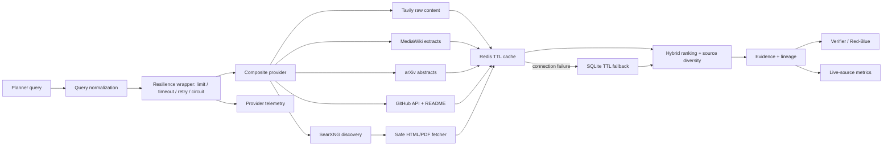

# Real Data Architecture

这份文档解释第二项目如何从 mock/offline 演示升级为可真实读取、可审计、可降级、可评测的数据系统。默认 benchmark 仍离线运行；只有用户显式开启时才访问外部来源。

## 数据链路



## 真实来源

| Provider | 读取内容 | 是否需要密钥 | 适用场景 | 当前边界 |
|---|---|---:|---|---|
| Wikipedia | MediaWiki article extract | 否 | 稳定背景知识、keyless smoke | 不适合最新事件或小众主题 |
| arXiv | Atom API 中的题目、摘要、时间和论文 URL | 否 | 论文检索、技术调研 | 当前读取摘要，不解析论文全文 |
| GitHub | 官方 Search API 元数据 + README | 否；Token 可提高限额 | 开源项目、技术栈和实现调研 | 匿名 API 限额较低，README 不等于代码审计 |
| Tavily | 搜索结果和 raw content | 是 | 通用、时效性 Web 调研 | 受额度和第三方抽取质量影响 |
| SearXNG | 自托管元搜索结果，并继续抓取目标页面 | 需要自托管服务 | 可控搜索入口 | 搜索引擎本身仍可能限流；动态页面可能抓取失败 |
| Direct URL | 问题中显式给出的公开 HTML/PDF/text URL | 否 | 阅读指定网页、报告或论文 PDF | 不处理登录态和 JavaScript 渲染 |
| Local document | 用户指定的单个文件或目录，支持 Markdown/TXT/HTML/PDF；PDF 逐页切块 | 否 | 真实论文、项目资料、企业脱敏文档 | 本地路径由用户显式提供，不自动扫描磁盘；扫描件仍需 OCR |
| Web upload | multipart 单文件 PDF/Markdown/TXT/HTML，内容寻址后构建 corpus | 否 | 面试现场上传论文、ToB 知识库 Demo | 本地单用户；无 OCR/杀毒/租户隔离/总存储配额 |

## 来源血缘字段

每个真实 Evidence 都应尽量保留以下字段：

- `provider`：来源适配器；
- `web_query`：清洗后实际发送的查询；
- `content_origin`：正文来自 API extract、README、raw content、页面抓取还是 snippet fallback；
- `fetch_status`：成功、provider content、网络失败、HTTP 失败、内容过大或格式不支持；
- `retrieved_at`：实际读取时间；
- `content_sha256`：用于判断缓存、内容变化和复现；
- `content_type`、`bytes_read`、`final_url`：抓取层观测字段；
- `cache_backend`、`cache_hit`、`cache_error`、`cache_fallback_from`：缓存行为；
- `risk_flags`：网页中疑似 Prompt Injection 的提示。
- `provider_attempts`、`provider_retries`、`provider_latency_seconds`、`provider_circuit_state`：Provider 传输层行为。

这些字段最终随 Evidence 写入 SQLite，而不是只出现在日志里。

本地 PDF 额外记录 `page_number/page_start/page_end/source_page_count/citation_locator`，chunk id 包含 `pNNN`。已用用户的 6 页 ASCC 论文真实构建 64 个 chunks，并检索到带 `p. 1`、`p. 2` 定位的 Evidence；原 PDF 与生成语料均不提交仓库。

Web 上传额外记录 `upload_id/original_name/uploaded_content_sha256`，并复用 Prompt Injection 风险检测。相同文件内容即使文件名不同也复用同一 corpus；上传 API 实跑后，真实论文研究结果的 16 条 Evidence 全部能回到 upload id 和页码。

## 安全读取

`WebPageFetcher` 只允许 HTTP/HTTPS，并在访问前解析域名，拒绝 localhost、`.local`、环回、私网、链路本地和其他非公网地址。重定向也会在跟随前重新校验，防止通过公开 URL 跳转到内网。

读取还包含：

- 单请求超时和有限指数退避；
- 最大响应体限制；
- HTML 中 script/style/nav/footer 等噪声剔除；
- PDF 文本解析；
- 非支持类型和空正文显式失败；
- Prompt Injection 只做风险标记，不把网页指令当系统指令执行。

## Provider 韧性与遥测

联网 Provider 由统一 `ResilientWebSearchProvider` 包装：单 Provider 并发上限避免请求风暴，GitHub 额外设置最小请求间隔；每次调用有 25 秒硬超时、最多 1 次指数退避重试，连续 3 次传输失败后熔断 30 秒，并用 half-open 请求探测恢复。空结果代表上游正常响应但没有命中，不计作传输故障。

遥测只保留截断后的 query preview 与 SHA-256，不记录 API key。运行摘要包含 provider/status 分布、operational rate、总重试数、平均/最大延迟和 circuit-open 次数；Web Demo 同步展示这些指标。单 Provider 最多保留最近 200 个事件，避免长时间进程无限增长。

## SQLite 与 Redis 的职责

SQLite 是 canonical store，保存研究运行、任务、证据、claim、验证 trace 和 repair action；它强调可审计与本地复现。

搜索 cache 默认也使用 SQLite，启用 WAL、10 秒 busy timeout 和 TTL，适合单机作品演示及并发读写。Redis 是可选共享 TTL cache，适合多个 API worker：

```powershell
uv sync --extra enterprise --extra web --extra dev
docker compose -f compose.redis.yml up -d
$env:REDIS_URL='redis://127.0.0.1:6379/0'
uv run python scripts/inspect_web_search.py "deep research agent" `
  --provider wikipedia,arxiv,github `
  --cache-backend redis
```

Redis 连接失败时自动写入 SQLite fallback。Redis 不保存 canonical evidence，避免把易失缓存误当事实库。

## 真实数据评测

真实 provider 不能用普通 mock 单元测试代替。运行：

```powershell
uv run python scripts/run_live_source_eval.py --fail-on-error
```

当前评测检查：

- provider 是否返回最小数量结果；
- top-k 是否出现预期主题标题；
- URL 协议和域名是否合法；
- 正文长度是否达到最低要求；
- lineage 字段是否完整；
- attempts/retries/latency/circuit state 传输遥测是否完整；
- 第二次查询是否命中 TTL cache；
- 首次请求和缓存请求延迟。

当前数据集包含 12 个案例：3 个 Wikipedia、4 个 arXiv、3 个 GitHub 仓库搜索和 2 个直接 README URL。`reports/live_source_eval/resilience_12_cases_v2/report.md` 的实跑结果为 12/12，平均 lineage 完整率、transport telemetry 完整率与二次缓存命中率均为 1.000。

每周 GitHub Actions monitor 会将每次 metrics 压缩为不含查询正文的 snapshot，保存 success/cache/lineage/telemetry、mean/P95 latency、retry/circuit 和 failure cases。滚动 history 通过 cache 跨 workflow run 延续，每次完整报告通过 artifact 保留 30 天；cache 不是永久数据库，因此只能作为作品集监控证据。当前仅有 1 次本地真实 snapshot，不能据此计算生产 SLA。

离线 CI 不强制访问公网，真实评测单独运行并保留报告。这是为了区分“代码回归失败”和“外部服务暂时不可用”。

## 企业知识点对应

这条链路可以用于学习和面试解释：

- 异步 IO 与阻塞调用为什么要放入线程池；
- SSRF、重定向和不可信网页内容如何防护；
- 搜索发现与正文读取为什么需要解耦；
- Redis cache 与 SQLite source of truth 如何分工；
- TTL、cache hit、降级和幂等键怎么设计；
- 外部 API 的超时、限流、失败和可观测性；
- 为什么 live eval 与 deterministic benchmark 必须分开；
- claim-level citation 如何回到真实 URL、正文 hash 和抓取时间。

## 仍然诚实保留的边界

- 没有实现 Playwright/浏览器级 JavaScript 渲染，因此部分动态页面只能降级为 snippet。
- 没有处理登录态、付费墙和网站验证码。
- arXiv 在线 Provider 当前只使用摘要；本地文本型 PDF 已支持页码级引用，但自动下载论文、双栏版面重建、表格/公式定位和扫描件 OCR 仍未实现。
- Prompt Injection 当前是规则标记，不是完备的安全分类器。
- 已建立每周 live-source monitor，但当前历史只有 1 个真实观测；积累足够窗口前不声明生产 SLA。
