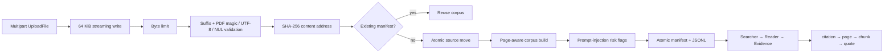

# Secure Upload and Real-Document Ingestion

Web Demo 支持用户上传真实 PDF、Markdown、TXT 或 HTML，并立即将生成的 corpus 用于 DeepResearch run。这条链路解决了“代码支持本地路径，但面试现场无法从页面放入真实资料”的断点。

## 数据链路

## 安全与可靠性设计

- 以 64 KiB 为单位读取 `UploadFile`，不先把整个请求体装入内存。
- 默认最大 10 MiB，可通过 `DEMO_MAX_UPLOAD_BYTES` 调整；超限返回 HTTP 413。
- 不信任浏览器 `Content-Type`。允许的扩展名只有 `.pdf/.md/.txt/.html`；PDF 必须有 `%PDF-` magic，文本必须是 UTF-8 且不能包含 NUL。
- 原始文件名仅作为展示 metadata，先去除目录部分和不可打印字符；实际存储名固定为 `document.<suffix>`，防止路径穿越。
- corpus id 来自完整文件 SHA-256 的前 16 个十六进制字符；相同内容复用已有 corpus，不因改名重复占用空间。
- 上传先进入 `.incoming/<uuid>.tmp`；验证失败或异常会清理临时文件。source、corpus 和 manifest 使用 replace 完成原子发布，未完成目录没有 manifest，不会被读取。
- 原始上传文件没有公开下载路由；研究链路只通过已构建的 corpus JSONL 读取。
- 每个 chunk 保留 `upload_id/original_name/uploaded_content_sha256/risk_flags`；PDF 继续保留页码 locator。

## API

- `POST /api/corpora/uploads`：multipart 字段名 `file`；新内容返回 201，重复内容返回 200 和 `deduplicated=true`。
- `GET /api/corpora/uploads`：列出最近上传的 corpus。
- `GET /api/corpora/uploads/{corpus_id}`：读取 manifest，不返回正文。
- `POST /api/runs`：设置 `uploaded_corpus_id` 后直接使用该 corpus；run 中记录 `corpus_profile=upload:<id>`。

## 真实论文验证

使用 `论文_ASCC26_conference_Mamh_0517.pdf` 走完整 multipart API：

- 文件大小：423,762 bytes；
- SHA-256：`86cd62ab08f5f931f53a06f20e0186e2b473576383bb71ff9884e0d83cdb95a9`；
- corpus id：`upload_86cd62ab08f5f931`；
- 识别 6 页，生成 64 chunks；
- 标题识别为 *Defect-Aware Bilateral-Constraint Slitting for Aluminum Foil: Waste Reduction and Economic Optimization*；
- 上传后研究 run `demo_cedf7ce41414` 成功，生成 16 条 Evidence，定位到 p.1、p.2、p.3 和 p.5，全部携带 upload lineage。

真实论文、上传目录、运行数据库和临时报告均由 `.gitignore` 排除，不进入作品仓库。

## 仍然保留的边界

- 当前是本地单用户作品 Demo，没有登录、租户隔离、用户级配额和授权删除。
- 只有单文件上传，不支持 ZIP/目录，主动避免压缩炸弹和复杂归档路径攻击。
- 没有杀毒引擎、DLP 或 sandbox；生产系统应在独立隔离服务中解析不可信 PDF，并跟踪解析库 CVE。
- 扫描 PDF 没有 OCR；加密、损坏、无可提取文本的 PDF 会返回 400。
- 默认 content id 使用 SHA-256 前 64 bit 作为目录名，同时在 manifest 保留完整 SHA-256；若检测到前缀碰撞会自动改用完整 digest。大规模多租户系统仍建议直接使用完整 digest。
- 暂无总存储配额和自动清理策略；容器使用独立 uploads volume，生产环境应接对象存储和生命周期规则。
