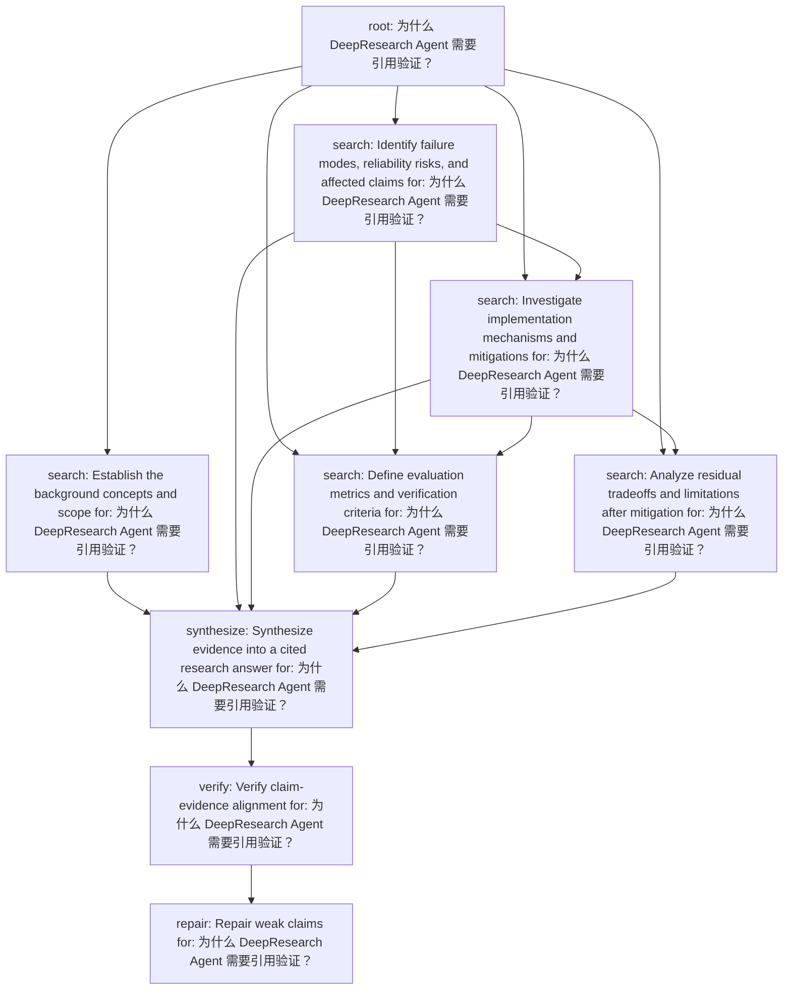

# Plan Inspection

Question: 为什么 DeepResearch Agent 需要引用验证？

## Summary

- tasks: 9
- dependencies: 16
- batches: 7
- plan type: risk_analysis

## Topological Batches

- Batch 1: task_d6f73e0d21ec (root)
- Batch 2: task_f0857be2a53b (search), task_22a59a8c7d8a (search)
- Batch 3: task_caebea9f0ce7 (search)
- Batch 4: task_9d18d292c2c5 (search), task_222804a5a330 (search)
- Batch 5: task_c65bced3283b (synthesize)
- Batch 6: task_eb0492e8c50a (verify)
- Batch 7: task_71eb6e7e4650 (repair)

## Tasks

### task_d6f73e0d21ec

- type: root
- dependencies: none
- question: 为什么 DeepResearch Agent 需要引用验证？
- expected evidence: Clarify the user's full research intent.

### task_f0857be2a53b

- type: search
- dependencies: task_d6f73e0d21ec
- question: Establish the background concepts and scope for: 为什么 DeepResearch Agent 需要引用验证？
- expected evidence: Find evidence about: Establish the background concepts and scope for: 为什么 DeepResearch Agent 需要引用验证？

### task_22a59a8c7d8a

- type: search
- dependencies: task_d6f73e0d21ec
- question: Identify failure modes, reliability risks, and affected claims for: 为什么 DeepResearch Agent 需要引用验证？
- expected evidence: Find evidence about: Identify failure modes, reliability risks, and affected claims for: 为什么 DeepResearch Agent 需要引用验证？

### task_caebea9f0ce7

- type: search
- dependencies: task_d6f73e0d21ec, task_22a59a8c7d8a
- question: Investigate implementation mechanisms and mitigations for: 为什么 DeepResearch Agent 需要引用验证？
- expected evidence: Find evidence about: Investigate implementation mechanisms and mitigations for: 为什么 DeepResearch Agent 需要引用验证？

### task_9d18d292c2c5

- type: search
- dependencies: task_d6f73e0d21ec, task_22a59a8c7d8a, task_caebea9f0ce7
- question: Define evaluation metrics and verification criteria for: 为什么 DeepResearch Agent 需要引用验证？
- expected evidence: Find evidence about: Define evaluation metrics and verification criteria for: 为什么 DeepResearch Agent 需要引用验证？

### task_222804a5a330

- type: search
- dependencies: task_d6f73e0d21ec, task_caebea9f0ce7
- question: Analyze residual tradeoffs and limitations after mitigation for: 为什么 DeepResearch Agent 需要引用验证？
- expected evidence: Find evidence about: Analyze residual tradeoffs and limitations after mitigation for: 为什么 DeepResearch Agent 需要引用验证？

### task_c65bced3283b

- type: synthesize
- dependencies: task_f0857be2a53b, task_22a59a8c7d8a, task_caebea9f0ce7, task_9d18d292c2c5, task_222804a5a330
- question: Synthesize evidence into a cited research answer for: 为什么 DeepResearch Agent 需要引用验证？
- expected evidence: Use retrieved evidence to draft report claims and sections.

### task_eb0492e8c50a

- type: verify
- dependencies: task_c65bced3283b
- question: Verify claim-evidence alignment for: 为什么 DeepResearch Agent 需要引用验证？
- expected evidence: Check unsupported claims, missing citations, and contradictions.

### task_71eb6e7e4650

- type: repair
- dependencies: task_eb0492e8c50a
- question: Repair weak claims for: 为什么 DeepResearch Agent 需要引用验证？
- expected evidence: Apply ADD, DELETE, MODIFY, or VERIFY actions when needed.

## Mermaid

