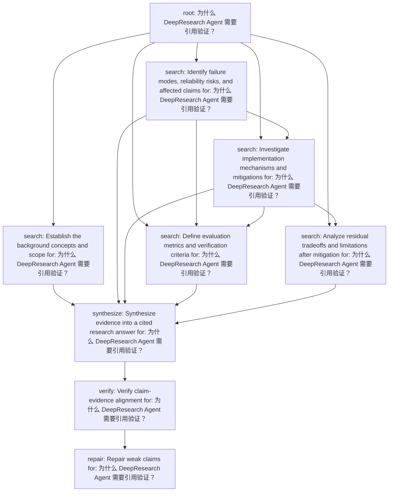

# Plan Inspection

Question: 为什么 DeepResearch Agent 需要引用验证？

## Summary

- tasks: 9
- dependencies: 16
- batches: 7
- plan type: risk_analysis

## Topological Batches

- Batch 1: task_4a67bcf7d407 (root)
- Batch 2: task_3be2107b5f75 (search), task_b872765c3e53 (search)
- Batch 3: task_513eb48799a7 (search)
- Batch 4: task_6d8e8c45a32f (search), task_c5f18b35988a (search)
- Batch 5: task_12f45f4e7239 (synthesize)
- Batch 6: task_2a337ff3ddf6 (verify)
- Batch 7: task_fde909067344 (repair)

## Tasks

### task_4a67bcf7d407

- type: root
- dependencies: none
- question: 为什么 DeepResearch Agent 需要引用验证？
- expected evidence: Clarify the user's full research intent.

### task_3be2107b5f75

- type: search
- dependencies: task_4a67bcf7d407
- question: Establish the background concepts and scope for: 为什么 DeepResearch Agent 需要引用验证？
- expected evidence: Find evidence about: Establish the background concepts and scope for: 为什么 DeepResearch Agent 需要引用验证？

### task_b872765c3e53

- type: search
- dependencies: task_4a67bcf7d407
- question: Identify failure modes, reliability risks, and affected claims for: 为什么 DeepResearch Agent 需要引用验证？
- expected evidence: Find evidence about: Identify failure modes, reliability risks, and affected claims for: 为什么 DeepResearch Agent 需要引用验证？

### task_513eb48799a7

- type: search
- dependencies: task_4a67bcf7d407, task_b872765c3e53
- question: Investigate implementation mechanisms and mitigations for: 为什么 DeepResearch Agent 需要引用验证？
- expected evidence: Find evidence about: Investigate implementation mechanisms and mitigations for: 为什么 DeepResearch Agent 需要引用验证？

### task_6d8e8c45a32f

- type: search
- dependencies: task_4a67bcf7d407, task_b872765c3e53, task_513eb48799a7
- question: Define evaluation metrics and verification criteria for: 为什么 DeepResearch Agent 需要引用验证？
- expected evidence: Find evidence about: Define evaluation metrics and verification criteria for: 为什么 DeepResearch Agent 需要引用验证？

### task_c5f18b35988a

- type: search
- dependencies: task_4a67bcf7d407, task_513eb48799a7
- question: Analyze residual tradeoffs and limitations after mitigation for: 为什么 DeepResearch Agent 需要引用验证？
- expected evidence: Find evidence about: Analyze residual tradeoffs and limitations after mitigation for: 为什么 DeepResearch Agent 需要引用验证？

### task_12f45f4e7239

- type: synthesize
- dependencies: task_3be2107b5f75, task_b872765c3e53, task_513eb48799a7, task_6d8e8c45a32f, task_c5f18b35988a
- question: Synthesize evidence into a cited research answer for: 为什么 DeepResearch Agent 需要引用验证？
- expected evidence: Use retrieved evidence to draft report claims and sections.

### task_2a337ff3ddf6

- type: verify
- dependencies: task_12f45f4e7239
- question: Verify claim-evidence alignment for: 为什么 DeepResearch Agent 需要引用验证？
- expected evidence: Check unsupported claims, missing citations, and contradictions.

### task_fde909067344

- type: repair
- dependencies: task_2a337ff3ddf6
- question: Repair weak claims for: 为什么 DeepResearch Agent 需要引用验证？
- expected evidence: Apply ADD, DELETE, MODIFY, or VERIFY actions when needed.

## Mermaid

