# Plan Inspection

Question: 请基于下面三份公开资料，为一个可审计的 DeepResearch Agent 设计工程方案：说明为什么要分别评测检索与生成、如何保留引用溯源，以及如何把提示注入作为不可信输入处理。请区分资料明确支持的结论与工程推断，并给出可以落地的最小检查清单。
https://www.nist.gov/publications/artificial-intelligence-risk-management-framework-generative-artificial-intelligence
https://genai.owasp.org/llmrisk/llm01-prompt-injection/
https://arxiv.org/abs/2405.07437

## Summary

- tasks: 9
- dependencies: 16
- batches: 7
- plan type: risk_analysis

## Topological Batches

- Batch 1: task_80f56be6b44d (root)
- Batch 2: task_af9129ae7aba (search), task_66ac0735b5b8 (search)
- Batch 3: task_e20598d2722d (search)
- Batch 4: task_d9d7a7f4af1b (search), task_fa5cb968f02a (search)
- Batch 5: task_e019bb611b9e (synthesize)
- Batch 6: task_de8485fa7539 (verify)
- Batch 7: task_b744bfc8dd09 (repair)

## Tasks

### task_80f56be6b44d

- type: root
- dependencies: none
- question: 请基于下面三份公开资料，为一个可审计的 DeepResearch Agent 设计工程方案：说明为什么要分别评测检索与生成、如何保留引用溯源，以及如何把提示注入作为不可信输入处理。请区分资料明确支持的结论与工程推断，并给出可以落地的最小检查清单。
https://www.nist.gov/publications/artificial-intelligence-risk-management-framework-generative-artificial-intelligence
https://genai.owasp.org/llmrisk/llm01-prompt-injection/
https://arxiv.org/abs/2405.07437
- expected evidence: Clarify the user's full research intent.

### task_af9129ae7aba

- type: search
- dependencies: task_80f56be6b44d
- question: Establish the background concepts and scope for: 请基于下面三份公开资料，为一个可审计的 DeepResearch Agent 设计工程方案：说明为什么要分别评测检索与生成、如何保留引用溯源，以及如何把提示注入作为不可信输入处理。请区分资料明确支持的结论与工程推断，并给出可以落地的最小检查清单。
https://www.nist.gov/publications/artificial-intelligence-risk-management-framework-generative-artificial-intelligence
https://genai.owasp.org/llmrisk/llm01-prompt-injection/
https://arxiv.org/abs/2405.07437
- expected evidence: Find evidence about: Establish the background concepts and scope for: 请基于下面三份公开资料，为一个可审计的 DeepResearch Agent 设计工程方案：说明为什么要分别评测检索与生成、如何保留引用溯源，以及如何把提示注入作为不可信输入处理。请区分资料明确支持的结论与工程推断，并给出可以落地的最小检查清单。
https://www.nist.gov/publications/artificial-intelligence-risk-management-framework-generative-artificial-intelligence
https://genai.owasp.org/llmrisk/llm01-prompt-injection/
https://arxiv.org/abs/2405.07437

### task_66ac0735b5b8

- type: search
- dependencies: task_80f56be6b44d
- question: Identify failure modes, reliability risks, and affected claims for: 请基于下面三份公开资料，为一个可审计的 DeepResearch Agent 设计工程方案：说明为什么要分别评测检索与生成、如何保留引用溯源，以及如何把提示注入作为不可信输入处理。请区分资料明确支持的结论与工程推断，并给出可以落地的最小检查清单。
https://www.nist.gov/publications/artificial-intelligence-risk-management-framework-generative-artificial-intelligence
https://genai.owasp.org/llmrisk/llm01-prompt-injection/
https://arxiv.org/abs/2405.07437
- expected evidence: Find evidence about: Identify failure modes, reliability risks, and affected claims for: 请基于下面三份公开资料，为一个可审计的 DeepResearch Agent 设计工程方案：说明为什么要分别评测检索与生成、如何保留引用溯源，以及如何把提示注入作为不可信输入处理。请区分资料明确支持的结论与工程推断，并给出可以落地的最小检查清单。
https://www.nist.gov/publications/artificial-intelligence-risk-management-framework-generative-artificial-intelligence
https://genai.owasp.org/llmrisk/llm01-prompt-injection/
https://arxiv.org/abs/2405.07437

### task_e20598d2722d

- type: search
- dependencies: task_80f56be6b44d, task_66ac0735b5b8
- question: Investigate implementation mechanisms and mitigations for: 请基于下面三份公开资料，为一个可审计的 DeepResearch Agent 设计工程方案：说明为什么要分别评测检索与生成、如何保留引用溯源，以及如何把提示注入作为不可信输入处理。请区分资料明确支持的结论与工程推断，并给出可以落地的最小检查清单。
https://www.nist.gov/publications/artificial-intelligence-risk-management-framework-generative-artificial-intelligence
https://genai.owasp.org/llmrisk/llm01-prompt-injection/
https://arxiv.org/abs/2405.07437
- expected evidence: Find evidence about: Investigate implementation mechanisms and mitigations for: 请基于下面三份公开资料，为一个可审计的 DeepResearch Agent 设计工程方案：说明为什么要分别评测检索与生成、如何保留引用溯源，以及如何把提示注入作为不可信输入处理。请区分资料明确支持的结论与工程推断，并给出可以落地的最小检查清单。
https://www.nist.gov/publications/artificial-intelligence-risk-management-framework-generative-artificial-intelligence
https://genai.owasp.org/llmrisk/llm01-prompt-injection/
https://arxiv.org/abs/2405.07437

### task_d9d7a7f4af1b

- type: search
- dependencies: task_80f56be6b44d, task_66ac0735b5b8, task_e20598d2722d
- question: Define evaluation metrics and verification criteria for: 请基于下面三份公开资料，为一个可审计的 DeepResearch Agent 设计工程方案：说明为什么要分别评测检索与生成、如何保留引用溯源，以及如何把提示注入作为不可信输入处理。请区分资料明确支持的结论与工程推断，并给出可以落地的最小检查清单。
https://www.nist.gov/publications/artificial-intelligence-risk-management-framework-generative-artificial-intelligence
https://genai.owasp.org/llmrisk/llm01-prompt-injection/
https://arxiv.org/abs/2405.07437
- expected evidence: Find evidence about: Define evaluation metrics and verification criteria for: 请基于下面三份公开资料，为一个可审计的 DeepResearch Agent 设计工程方案：说明为什么要分别评测检索与生成、如何保留引用溯源，以及如何把提示注入作为不可信输入处理。请区分资料明确支持的结论与工程推断，并给出可以落地的最小检查清单。
https://www.nist.gov/publications/artificial-intelligence-risk-management-framework-generative-artificial-intelligence
https://genai.owasp.org/llmrisk/llm01-prompt-injection/
https://arxiv.org/abs/2405.07437

### task_fa5cb968f02a

- type: search
- dependencies: task_80f56be6b44d, task_e20598d2722d
- question: Analyze residual tradeoffs and limitations after mitigation for: 请基于下面三份公开资料，为一个可审计的 DeepResearch Agent 设计工程方案：说明为什么要分别评测检索与生成、如何保留引用溯源，以及如何把提示注入作为不可信输入处理。请区分资料明确支持的结论与工程推断，并给出可以落地的最小检查清单。
https://www.nist.gov/publications/artificial-intelligence-risk-management-framework-generative-artificial-intelligence
https://genai.owasp.org/llmrisk/llm01-prompt-injection/
https://arxiv.org/abs/2405.07437
- expected evidence: Find evidence about: Analyze residual tradeoffs and limitations after mitigation for: 请基于下面三份公开资料，为一个可审计的 DeepResearch Agent 设计工程方案：说明为什么要分别评测检索与生成、如何保留引用溯源，以及如何把提示注入作为不可信输入处理。请区分资料明确支持的结论与工程推断，并给出可以落地的最小检查清单。
https://www.nist.gov/publications/artificial-intelligence-risk-management-framework-generative-artificial-intelligence
https://genai.owasp.org/llmrisk/llm01-prompt-injection/
https://arxiv.org/abs/2405.07437

### task_e019bb611b9e

- type: synthesize
- dependencies: task_af9129ae7aba, task_66ac0735b5b8, task_e20598d2722d, task_d9d7a7f4af1b, task_fa5cb968f02a
- question: Synthesize evidence into a cited research answer for: 请基于下面三份公开资料，为一个可审计的 DeepResearch Agent 设计工程方案：说明为什么要分别评测检索与生成、如何保留引用溯源，以及如何把提示注入作为不可信输入处理。请区分资料明确支持的结论与工程推断，并给出可以落地的最小检查清单。
https://www.nist.gov/publications/artificial-intelligence-risk-management-framework-generative-artificial-intelligence
https://genai.owasp.org/llmrisk/llm01-prompt-injection/
https://arxiv.org/abs/2405.07437
- expected evidence: Use retrieved evidence to draft report claims and sections.

### task_de8485fa7539

- type: verify
- dependencies: task_e019bb611b9e
- question: Verify claim-evidence alignment for: 请基于下面三份公开资料，为一个可审计的 DeepResearch Agent 设计工程方案：说明为什么要分别评测检索与生成、如何保留引用溯源，以及如何把提示注入作为不可信输入处理。请区分资料明确支持的结论与工程推断，并给出可以落地的最小检查清单。
https://www.nist.gov/publications/artificial-intelligence-risk-management-framework-generative-artificial-intelligence
https://genai.owasp.org/llmrisk/llm01-prompt-injection/
https://arxiv.org/abs/2405.07437
- expected evidence: Check unsupported claims, missing citations, and contradictions.

### task_b744bfc8dd09

- type: repair
- dependencies: task_de8485fa7539
- question: Repair weak claims for: 请基于下面三份公开资料，为一个可审计的 DeepResearch Agent 设计工程方案：说明为什么要分别评测检索与生成、如何保留引用溯源，以及如何把提示注入作为不可信输入处理。请区分资料明确支持的结论与工程推断，并给出可以落地的最小检查清单。
https://www.nist.gov/publications/artificial-intelligence-risk-management-framework-generative-artificial-intelligence
https://genai.owasp.org/llmrisk/llm01-prompt-injection/
https://arxiv.org/abs/2405.07437
- expected evidence: Apply ADD, DELETE, MODIFY, or VERIFY actions when needed.

## Mermaid

```mermaid
flowchart TD
    task_80f56be6b44d["root: 请基于下面三份公开资料，为一个可审计的 DeepResearch Agent 设计工程方案：说明为什么要分别评测检索与生成、如何保留引用溯源，以及如何把提示注入作为不可信输入处理。请区分资料明确支持的结论与工程推断，并给出可以落地的最小检查清单。
https://www.nist.gov/publications/artificial-intelligence-risk-management-framework-generative-artificial-intelligence
https://genai.owasp.org/llmrisk/llm01-prompt-injection/
https://arxiv.org/abs/2405.07437"]
    task_af9129ae7aba["search: Establish the background concepts and scope for: 请基于下面三份公开资料，为一个可审计的 DeepResearch Agent 设计工程方案：说明为什么要分别评测检索与生成、如何保留引用溯源，以及如何把提示注入作为不可信输入处理。请区分资料明确支持的结论与工程推断，并给出可以落地的最小检查清单。
https://www.nist.gov/publications/artificial-intelligence-risk-management-framework-generative-artificial-intelligence
https://genai.owasp.org/llmrisk/llm01-prompt-injection/
https://arxiv.org/abs/2405.07437"]
    task_66ac0735b5b8["search: Identify failure modes, reliability risks, and affected claims for: 请基于下面三份公开资料，为一个可审计的 DeepResearch Agent 设计工程方案：说明为什么要分别评测检索与生成、如何保留引用溯源，以及如何把提示注入作为不可信输入处理。请区分资料明确支持的结论与工程推断，并给出可以落地的最小检查清单。
https://www.nist.gov/publications/artificial-intelligence-risk-management-framework-generative-artificial-intelligence
https://genai.owasp.org/llmrisk/llm01-prompt-injection/
https://arxiv.org/abs/2405.07437"]
    task_e20598d2722d["search: Investigate implementation mechanisms and mitigations for: 请基于下面三份公开资料，为一个可审计的 DeepResearch Agent 设计工程方案：说明为什么要分别评测检索与生成、如何保留引用溯源，以及如何把提示注入作为不可信输入处理。请区分资料明确支持的结论与工程推断，并给出可以落地的最小检查清单。
https://www.nist.gov/publications/artificial-intelligence-risk-management-framework-generative-artificial-intelligence
https://genai.owasp.org/llmrisk/llm01-prompt-injection/
https://arxiv.org/abs/2405.07437"]
    task_d9d7a7f4af1b["search: Define evaluation metrics and verification criteria for: 请基于下面三份公开资料，为一个可审计的 DeepResearch Agent 设计工程方案：说明为什么要分别评测检索与生成、如何保留引用溯源，以及如何把提示注入作为不可信输入处理。请区分资料明确支持的结论与工程推断，并给出可以落地的最小检查清单。
https://www.nist.gov/publications/artificial-intelligence-risk-management-framework-generative-artificial-intelligence
https://genai.owasp.org/llmrisk/llm01-prompt-injection/
https://arxiv.org/abs/2405.07437"]
    task_fa5cb968f02a["search: Analyze residual tradeoffs and limitations after mitigation for: 请基于下面三份公开资料，为一个可审计的 DeepResearch Agent 设计工程方案：说明为什么要分别评测检索与生成、如何保留引用溯源，以及如何把提示注入作为不可信输入处理。请区分资料明确支持的结论与工程推断，并给出可以落地的最小检查清单。
https://www.nist.gov/publications/artificial-intelligence-risk-management-framework-generative-artificial-intelligence
https://genai.owasp.org/llmrisk/llm01-prompt-injection/
https://arxiv.org/abs/2405.07437"]
    task_e019bb611b9e["synthesize: Synthesize evidence into a cited research answer for: 请基于下面三份公开资料，为一个可审计的 DeepResearch Agent 设计工程方案：说明为什么要分别评测检索与生成、如何保留引用溯源，以及如何把提示注入作为不可信输入处理。请区分资料明确支持的结论与工程推断，并给出可以落地的最小检查清单。
https://www.nist.gov/publications/artificial-intelligence-risk-management-framework-generative-artificial-intelligence
https://genai.owasp.org/llmrisk/llm01-prompt-injection/
https://arxiv.org/abs/2405.07437"]
    task_de8485fa7539["verify: Verify claim-evidence alignment for: 请基于下面三份公开资料，为一个可审计的 DeepResearch Agent 设计工程方案：说明为什么要分别评测检索与生成、如何保留引用溯源，以及如何把提示注入作为不可信输入处理。请区分资料明确支持的结论与工程推断，并给出可以落地的最小检查清单。
https://www.nist.gov/publications/artificial-intelligence-risk-management-framework-generative-artificial-intelligence
https://genai.owasp.org/llmrisk/llm01-prompt-injection/
https://arxiv.org/abs/2405.07437"]
    task_b744bfc8dd09["repair: Repair weak claims for: 请基于下面三份公开资料，为一个可审计的 DeepResearch Agent 设计工程方案：说明为什么要分别评测检索与生成、如何保留引用溯源，以及如何把提示注入作为不可信输入处理。请区分资料明确支持的结论与工程推断，并给出可以落地的最小检查清单。
https://www.nist.gov/publications/artificial-intelligence-risk-management-framework-generative-artificial-intelligence
https://genai.owasp.org/llmrisk/llm01-prompt-injection/
https://arxiv.org/abs/2405.07437"]
    task_80f56be6b44d --> task_af9129ae7aba
    task_80f56be6b44d --> task_66ac0735b5b8
    task_80f56be6b44d --> task_e20598d2722d
    task_66ac0735b5b8 --> task_e20598d2722d
    task_80f56be6b44d --> task_d9d7a7f4af1b
    task_66ac0735b5b8 --> task_d9d7a7f4af1b
    task_e20598d2722d --> task_d9d7a7f4af1b
    task_80f56be6b44d --> task_fa5cb968f02a
    task_e20598d2722d --> task_fa5cb968f02a
    task_af9129ae7aba --> task_e019bb611b9e
    task_66ac0735b5b8 --> task_e019bb611b9e
    task_e20598d2722d --> task_e019bb611b9e
    task_d9d7a7f4af1b --> task_e019bb611b9e
    task_fa5cb968f02a --> task_e019bb611b9e
    task_e019bb611b9e --> task_de8485fa7539
    task_de8485fa7539 --> task_b744bfc8dd09
```

