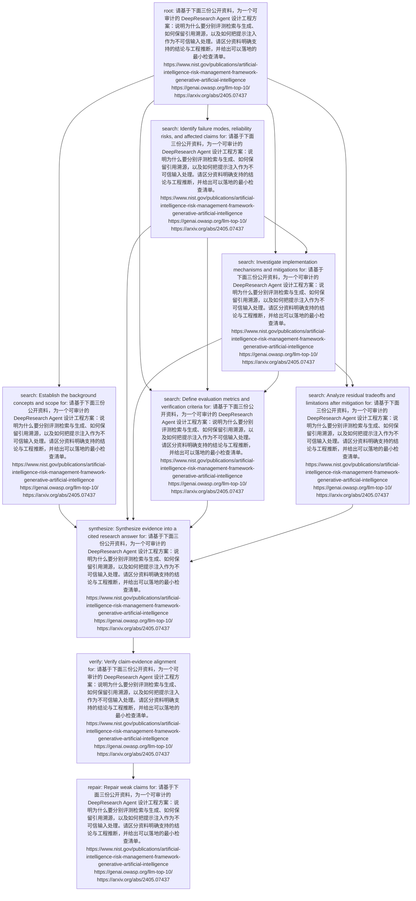

# Plan Inspection

Question: 请基于下面三份公开资料，为一个可审计的 DeepResearch Agent 设计工程方案：说明为什么要分别评测检索与生成、如何保留引用溯源，以及如何把提示注入作为不可信输入处理。请区分资料明确支持的结论与工程推断，并给出可以落地的最小检查清单。
https://www.nist.gov/publications/artificial-intelligence-risk-management-framework-generative-artificial-intelligence
https://genai.owasp.org/llm-top-10/
https://arxiv.org/abs/2405.07437

## Summary

- tasks: 9
- dependencies: 16
- batches: 7
- plan type: risk_analysis

## Topological Batches

- Batch 1: task_f2f76ea6e16d (root)
- Batch 2: task_88199d221130 (search), task_51f0d6f63df3 (search)
- Batch 3: task_001b864f772f (search)
- Batch 4: task_04b28b627954 (search), task_75752fb5beca (search)
- Batch 5: task_6f920504e8ae (synthesize)
- Batch 6: task_a1617162ed78 (verify)
- Batch 7: task_f5613604aed7 (repair)

## Tasks

### task_f2f76ea6e16d

- type: root
- dependencies: none
- question: 请基于下面三份公开资料，为一个可审计的 DeepResearch Agent 设计工程方案：说明为什么要分别评测检索与生成、如何保留引用溯源，以及如何把提示注入作为不可信输入处理。请区分资料明确支持的结论与工程推断，并给出可以落地的最小检查清单。
https://www.nist.gov/publications/artificial-intelligence-risk-management-framework-generative-artificial-intelligence
https://genai.owasp.org/llm-top-10/
https://arxiv.org/abs/2405.07437
- expected evidence: Clarify the user's full research intent.

### task_88199d221130

- type: search
- dependencies: task_f2f76ea6e16d
- question: Establish the background concepts and scope for: 请基于下面三份公开资料，为一个可审计的 DeepResearch Agent 设计工程方案：说明为什么要分别评测检索与生成、如何保留引用溯源，以及如何把提示注入作为不可信输入处理。请区分资料明确支持的结论与工程推断，并给出可以落地的最小检查清单。
https://www.nist.gov/publications/artificial-intelligence-risk-management-framework-generative-artificial-intelligence
https://genai.owasp.org/llm-top-10/
https://arxiv.org/abs/2405.07437
- expected evidence: Find evidence about: Establish the background concepts and scope for: 请基于下面三份公开资料，为一个可审计的 DeepResearch Agent 设计工程方案：说明为什么要分别评测检索与生成、如何保留引用溯源，以及如何把提示注入作为不可信输入处理。请区分资料明确支持的结论与工程推断，并给出可以落地的最小检查清单。
https://www.nist.gov/publications/artificial-intelligence-risk-management-framework-generative-artificial-intelligence
https://genai.owasp.org/llm-top-10/
https://arxiv.org/abs/2405.07437

### task_51f0d6f63df3

- type: search
- dependencies: task_f2f76ea6e16d
- question: Identify failure modes, reliability risks, and affected claims for: 请基于下面三份公开资料，为一个可审计的 DeepResearch Agent 设计工程方案：说明为什么要分别评测检索与生成、如何保留引用溯源，以及如何把提示注入作为不可信输入处理。请区分资料明确支持的结论与工程推断，并给出可以落地的最小检查清单。
https://www.nist.gov/publications/artificial-intelligence-risk-management-framework-generative-artificial-intelligence
https://genai.owasp.org/llm-top-10/
https://arxiv.org/abs/2405.07437
- expected evidence: Find evidence about: Identify failure modes, reliability risks, and affected claims for: 请基于下面三份公开资料，为一个可审计的 DeepResearch Agent 设计工程方案：说明为什么要分别评测检索与生成、如何保留引用溯源，以及如何把提示注入作为不可信输入处理。请区分资料明确支持的结论与工程推断，并给出可以落地的最小检查清单。
https://www.nist.gov/publications/artificial-intelligence-risk-management-framework-generative-artificial-intelligence
https://genai.owasp.org/llm-top-10/
https://arxiv.org/abs/2405.07437

### task_001b864f772f

- type: search
- dependencies: task_f2f76ea6e16d, task_51f0d6f63df3
- question: Investigate implementation mechanisms and mitigations for: 请基于下面三份公开资料，为一个可审计的 DeepResearch Agent 设计工程方案：说明为什么要分别评测检索与生成、如何保留引用溯源，以及如何把提示注入作为不可信输入处理。请区分资料明确支持的结论与工程推断，并给出可以落地的最小检查清单。
https://www.nist.gov/publications/artificial-intelligence-risk-management-framework-generative-artificial-intelligence
https://genai.owasp.org/llm-top-10/
https://arxiv.org/abs/2405.07437
- expected evidence: Find evidence about: Investigate implementation mechanisms and mitigations for: 请基于下面三份公开资料，为一个可审计的 DeepResearch Agent 设计工程方案：说明为什么要分别评测检索与生成、如何保留引用溯源，以及如何把提示注入作为不可信输入处理。请区分资料明确支持的结论与工程推断，并给出可以落地的最小检查清单。
https://www.nist.gov/publications/artificial-intelligence-risk-management-framework-generative-artificial-intelligence
https://genai.owasp.org/llm-top-10/
https://arxiv.org/abs/2405.07437

### task_04b28b627954

- type: search
- dependencies: task_f2f76ea6e16d, task_51f0d6f63df3, task_001b864f772f
- question: Define evaluation metrics and verification criteria for: 请基于下面三份公开资料，为一个可审计的 DeepResearch Agent 设计工程方案：说明为什么要分别评测检索与生成、如何保留引用溯源，以及如何把提示注入作为不可信输入处理。请区分资料明确支持的结论与工程推断，并给出可以落地的最小检查清单。
https://www.nist.gov/publications/artificial-intelligence-risk-management-framework-generative-artificial-intelligence
https://genai.owasp.org/llm-top-10/
https://arxiv.org/abs/2405.07437
- expected evidence: Find evidence about: Define evaluation metrics and verification criteria for: 请基于下面三份公开资料，为一个可审计的 DeepResearch Agent 设计工程方案：说明为什么要分别评测检索与生成、如何保留引用溯源，以及如何把提示注入作为不可信输入处理。请区分资料明确支持的结论与工程推断，并给出可以落地的最小检查清单。
https://www.nist.gov/publications/artificial-intelligence-risk-management-framework-generative-artificial-intelligence
https://genai.owasp.org/llm-top-10/
https://arxiv.org/abs/2405.07437

### task_75752fb5beca

- type: search
- dependencies: task_f2f76ea6e16d, task_001b864f772f
- question: Analyze residual tradeoffs and limitations after mitigation for: 请基于下面三份公开资料，为一个可审计的 DeepResearch Agent 设计工程方案：说明为什么要分别评测检索与生成、如何保留引用溯源，以及如何把提示注入作为不可信输入处理。请区分资料明确支持的结论与工程推断，并给出可以落地的最小检查清单。
https://www.nist.gov/publications/artificial-intelligence-risk-management-framework-generative-artificial-intelligence
https://genai.owasp.org/llm-top-10/
https://arxiv.org/abs/2405.07437
- expected evidence: Find evidence about: Analyze residual tradeoffs and limitations after mitigation for: 请基于下面三份公开资料，为一个可审计的 DeepResearch Agent 设计工程方案：说明为什么要分别评测检索与生成、如何保留引用溯源，以及如何把提示注入作为不可信输入处理。请区分资料明确支持的结论与工程推断，并给出可以落地的最小检查清单。
https://www.nist.gov/publications/artificial-intelligence-risk-management-framework-generative-artificial-intelligence
https://genai.owasp.org/llm-top-10/
https://arxiv.org/abs/2405.07437

### task_6f920504e8ae

- type: synthesize
- dependencies: task_88199d221130, task_51f0d6f63df3, task_001b864f772f, task_04b28b627954, task_75752fb5beca
- question: Synthesize evidence into a cited research answer for: 请基于下面三份公开资料，为一个可审计的 DeepResearch Agent 设计工程方案：说明为什么要分别评测检索与生成、如何保留引用溯源，以及如何把提示注入作为不可信输入处理。请区分资料明确支持的结论与工程推断，并给出可以落地的最小检查清单。
https://www.nist.gov/publications/artificial-intelligence-risk-management-framework-generative-artificial-intelligence
https://genai.owasp.org/llm-top-10/
https://arxiv.org/abs/2405.07437
- expected evidence: Use retrieved evidence to draft report claims and sections.

### task_a1617162ed78

- type: verify
- dependencies: task_6f920504e8ae
- question: Verify claim-evidence alignment for: 请基于下面三份公开资料，为一个可审计的 DeepResearch Agent 设计工程方案：说明为什么要分别评测检索与生成、如何保留引用溯源，以及如何把提示注入作为不可信输入处理。请区分资料明确支持的结论与工程推断，并给出可以落地的最小检查清单。
https://www.nist.gov/publications/artificial-intelligence-risk-management-framework-generative-artificial-intelligence
https://genai.owasp.org/llm-top-10/
https://arxiv.org/abs/2405.07437
- expected evidence: Check unsupported claims, missing citations, and contradictions.

### task_f5613604aed7

- type: repair
- dependencies: task_a1617162ed78
- question: Repair weak claims for: 请基于下面三份公开资料，为一个可审计的 DeepResearch Agent 设计工程方案：说明为什么要分别评测检索与生成、如何保留引用溯源，以及如何把提示注入作为不可信输入处理。请区分资料明确支持的结论与工程推断，并给出可以落地的最小检查清单。
https://www.nist.gov/publications/artificial-intelligence-risk-management-framework-generative-artificial-intelligence
https://genai.owasp.org/llm-top-10/
https://arxiv.org/abs/2405.07437
- expected evidence: Apply ADD, DELETE, MODIFY, or VERIFY actions when needed.

## Mermaid

