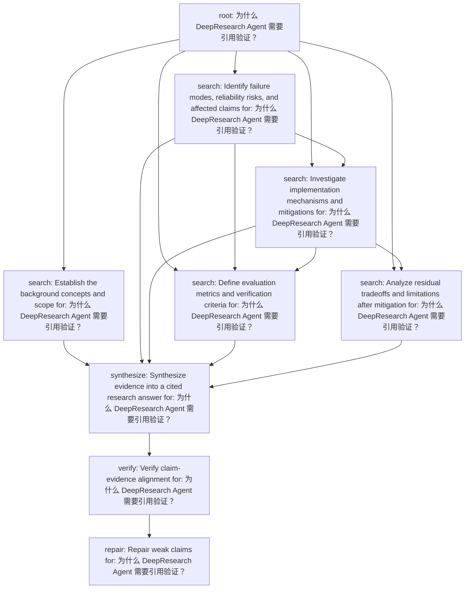

# Plan Inspection

Question: 为什么 DeepResearch Agent 需要引用验证？

## Summary

- tasks: 9
- dependencies: 16
- batches: 7
- plan type: risk_analysis

## Topological Batches

- Batch 1: task_e998db115062 (root)
- Batch 2: task_e789616b8e2a (search), task_ec8deabc62d0 (search)
- Batch 3: task_ed0e4c5d9c14 (search)
- Batch 4: task_ff14d11f082e (search), task_99db92f8a44e (search)
- Batch 5: task_7c2e3982f195 (synthesize)
- Batch 6: task_473792272d97 (verify)
- Batch 7: task_6ca778bad18c (repair)

## Tasks

### task_e998db115062

- type: root
- dependencies: none
- question: 为什么 DeepResearch Agent 需要引用验证？
- expected evidence: Clarify the user's full research intent.

### task_e789616b8e2a

- type: search
- dependencies: task_e998db115062
- question: Establish the background concepts and scope for: 为什么 DeepResearch Agent 需要引用验证？
- expected evidence: Find evidence about: Establish the background concepts and scope for: 为什么 DeepResearch Agent 需要引用验证？

### task_ec8deabc62d0

- type: search
- dependencies: task_e998db115062
- question: Identify failure modes, reliability risks, and affected claims for: 为什么 DeepResearch Agent 需要引用验证？
- expected evidence: Find evidence about: Identify failure modes, reliability risks, and affected claims for: 为什么 DeepResearch Agent 需要引用验证？

### task_ed0e4c5d9c14

- type: search
- dependencies: task_e998db115062, task_ec8deabc62d0
- question: Investigate implementation mechanisms and mitigations for: 为什么 DeepResearch Agent 需要引用验证？
- expected evidence: Find evidence about: Investigate implementation mechanisms and mitigations for: 为什么 DeepResearch Agent 需要引用验证？

### task_ff14d11f082e

- type: search
- dependencies: task_e998db115062, task_ec8deabc62d0, task_ed0e4c5d9c14
- question: Define evaluation metrics and verification criteria for: 为什么 DeepResearch Agent 需要引用验证？
- expected evidence: Find evidence about: Define evaluation metrics and verification criteria for: 为什么 DeepResearch Agent 需要引用验证？

### task_99db92f8a44e

- type: search
- dependencies: task_e998db115062, task_ed0e4c5d9c14
- question: Analyze residual tradeoffs and limitations after mitigation for: 为什么 DeepResearch Agent 需要引用验证？
- expected evidence: Find evidence about: Analyze residual tradeoffs and limitations after mitigation for: 为什么 DeepResearch Agent 需要引用验证？

### task_7c2e3982f195

- type: synthesize
- dependencies: task_e789616b8e2a, task_ec8deabc62d0, task_ed0e4c5d9c14, task_ff14d11f082e, task_99db92f8a44e
- question: Synthesize evidence into a cited research answer for: 为什么 DeepResearch Agent 需要引用验证？
- expected evidence: Use retrieved evidence to draft report claims and sections.

### task_473792272d97

- type: verify
- dependencies: task_7c2e3982f195
- question: Verify claim-evidence alignment for: 为什么 DeepResearch Agent 需要引用验证？
- expected evidence: Check unsupported claims, missing citations, and contradictions.

### task_6ca778bad18c

- type: repair
- dependencies: task_473792272d97
- question: Repair weak claims for: 为什么 DeepResearch Agent 需要引用验证？
- expected evidence: Apply ADD, DELETE, MODIFY, or VERIFY actions when needed.

## Mermaid

